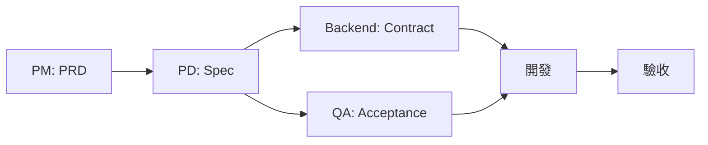

# Product Spec Generator

> From Requirements to Code, Together with AI

讓產品團隊和 AI 協作產出規格的企業級標準。

---

## 啟動流程

當用戶首次使用此 Skill 時，請先詢問：

```
歡迎使用 Product Spec Generator！

在開始之前，請選擇您偏好的語言：
1. 繁體中文
2. English

請輸入 1 或 2：
```

根據用戶選擇，後續所有文件輸出將使用對應語言。

### 語言設定對照

| 項目 | 繁體中文 | English |
|-----|---------|---------|
| 資料夾名稱 | 功能規格、產品需求文件、知識庫 | specs、requirements、knowledge |
| 檔案名稱 | 規格.md、驗收.md、API合約.md | spec.md、acceptance.md、contract.md |
| 文件標題 | 用戶引導 - 功能規格 | User Onboarding - Spec |

---

## 核心理念

1. **角色導向**：每個角色都知道自己要讀什麼、產出什麼
2. **文件連動**：PRD → Spec → Contract → Acceptance 環環相扣
3. **待確認事項追蹤**：所有未決定項目集中管理（Outstanding Items）
4. **視覺化規格**：Mockup 圖片 + Mermaid 流程圖
5. **Human-AI Hybrid**：真人和 AI 都能讀懂、都能產出

---

## 角色總覽

| 角色 | 核心職責 | 主要產出 | 詳細指南 |
|-----|---------|---------|---------|
| **Coordinator** | 協調所有角色、追蹤進度 | 專案狀態報告 | [→ agents/coordinator.md](agents/coordinator.md) |
| **PM** | 定義需求和優先級 | PRD（產品需求文件） | [→ agents/pm.md](agents/pm.md) |
| **PD** | 需求轉規格、設計體驗 | Spec（功能規格） | [→ agents/pd.md](agents/pd.md) |
| **Backend** | API 和資料結構設計 | Contract（API 合約） | [→ agents/backend.md](agents/backend.md) |
| **QA** | 驗收標準定義 | Acceptance（驗收標準） | [→ agents/qa.md](agents/qa.md) |
| **Web** | 網頁前端實作 | Web 程式碼 | [→ agents/web.md](agents/web.md) |
| **App** | iOS/Android 實作 | App 程式碼 | [→ agents/app.md](agents/app.md) |

---

## 專案結構

### 繁體中文版

```
your-project/
│
├── 產品需求文件/              # PM 的工作區
│   ├── 產品路線圖.md          # 產品功能總覽
│   └── ph0/                  # Phase 0 需求文件
│       ├── _overview.md      # Phase 總覽
│       └── {功能名稱}.md     # 各功能 PRD
│
├── 功能規格/                  # PD/Backend/QA 的工作區
│   ├── 功能地圖.md           # 頁面與功能對應
│   ├── 基礎建設/
│   │   ├── 設計系統規格.md   # Design System
│   │   └── 元件規格.md       # 元件定義
│   └── {功能名稱}/
│       ├── 規格.md           # PD 產出
│       ├── API合約.md        # Backend 產出
│       ├── 驗收.md           # QA 產出
│       └── Mockup/           # 設計稿圖片
│           └── {頁面名稱}.png
│
└── 知識庫/                    # 領域知識與商業邏輯
    ├── 領域知識/
    ├── 商業邏輯/
    └── 第三方串接/
```

### English Version

```
your-project/
│
├── requirements/              # PM workspace
│   ├── roadmap.md            # Product roadmap
│   └── ph0/                  # Phase 0 requirements
│       ├── _overview.md      # Phase overview
│       └── {feature-name}.md # Feature PRDs
│
├── specs/                     # PD/Backend/QA workspace
│   ├── feature-map.md        # Page-feature mapping
│   ├── infrastructure/
│   │   ├── design-system.md  # Design System
│   │   └── components.md     # Component definitions
│   └── {feature-name}/
│       ├── spec.md           # PD output
│       ├── contract.md       # Backend output
│       ├── acceptance.md     # QA output
│       └── mockup/           # Design mockups
│           └── {page-name}.png
│
└── knowledge/                 # Domain knowledge
    ├── domain/
    ├── business-logic/
    └── integrations/
```

---

## 協作流程



**Coordinator 的角色**：在每個階段協調各角色，追蹤待確認事項，確保文件一致性。

---

## 快速開始

### 你是什麼角色？

| 角色 | 說明 | 快速指令 |
|-----|------|---------|
| **Coordinator** | 我要協調專案、追蹤進度 | `開始新功能：{功能名稱}` |
| **PM** | 我要提需求、管理 Backlog | `幫我撰寫「{功能}」的 PRD` |
| **PD** | 我要把需求轉成規格 + 設計 | `幫我撰寫「{功能}」的規格` |
| **Backend** | 我要定義 API 和資料結構 | `幫我撰寫「{功能}」的 API 合約` |
| **QA** | 我要寫驗收標準 | `幫我撰寫「{功能}」的驗收標準` |
| **Web** | 我要實作網頁前端 | `請根據 spec.md 和 contract.md 實作網頁前端` |
| **App** | 我要實作 iOS/Android App | `請根據 spec.md 和 contract.md 實作 App` |

---

## 角色定義

### Coordinator

**職責**：協調所有角色、追蹤進度、確保文件一致性

| 輸入 | 產出 |
|-----|------|
| 所有功能文件 | 專案狀態報告 |
| 各角色產出 | 待確認事項清單 |

**主要工作**：
- 專案啟動：建立文件結構、指派角色順序
- 進度追蹤：彙整文件完成狀態
- 待確認事項：從所有文件彙整 Outstanding Items
- 文件一致性：檢查各文件間的連動是否正確

**詳細指南**：[→ agents/coordinator.md](agents/coordinator.md)

---

### PM

**職責**：定義「為什麼」和「要什麼」

| 輸入 | 產出 |
|-----|------|
| 用戶反饋、市場研究 | PRD（功能需求文件） |
| 商業目標、數據分析 | Backlog 任務管理 |

**快速指令**：
```
幫我撰寫「{功能名稱}」的 PRD
```

**詳細指南**：[→ agents/pm.md](agents/pm.md)

---

### PD

**職責**：把需求轉換成可執行的規格 + 設計體驗

| 輸入 | 產出 |
|-----|------|
| PRD | Spec（功能規格） |
| 商業邏輯、領域知識 | 含設計規格、Mockup |

**Mockup 要求**：每個頁面都應該有對應的 Mockup 圖片，放在 `Mockup/` 資料夾中。

**快速指令**：
```
幫我撰寫「{功能名稱}」的規格
```

**詳細指南**：[→ agents/pd.md](agents/pd.md)

---

### Backend

**職責**：定義 API 和資料結構

| 輸入 | 產出 |
|-----|------|
| PRD、Spec | Contract（API 合約） |
| 商業邏輯、第三方串接 | 資料結構定義 |

**快速指令**：
```
幫我撰寫「{功能名稱}」的 API 合約
```

**詳細指南**：[→ agents/backend.md](agents/backend.md)

---

### QA

**職責**：定義驗收標準和測試案例

| 輸入 | 產出 |
|-----|------|
| PRD、Spec、Contract | Acceptance（驗收標準） |

**測試案例編號**：使用 `TC-{類型}-{編號}` 格式，如 `TC-FL-001`（流程測試）

**快速指令**：
```
幫我撰寫「{功能名稱}」的驗收標準
```

**詳細指南**：[→ agents/qa.md](agents/qa.md)

---

### Web

**職責**：實作網頁前端介面

| 輸入 | 產出 |
|-----|------|
| Spec、Contract | Web 程式碼 |

**詳細指南**：[→ agents/web.md](agents/web.md)

---

### App

**職責**：實作 iOS / Android App

| 輸入 | 產出 |
|-----|------|
| Spec、Contract | iOS / Android 程式碼 |

**詳細指南**：[→ agents/app.md](agents/app.md)

---

## 文件類型說明

| 類型 | 負責人 | 說明 | 範本 |
|-----|-------|------|------|
| PRD | PM | 產品需求文件，定義功能目標與範圍 | [→ templates/prd.md](templates/prd.md) |
| Spec | PD | 功能規格，定義 UI/UX 與互動細節 | [→ templates/spec.md](templates/spec.md) |
| Contract | Backend | API 規格，定義資料結構與端點 | [→ templates/contract.md](templates/contract.md) |
| Acceptance | QA | 驗收標準，定義測試案例與通過條件 | [→ templates/acceptance.md](templates/acceptance.md) |

---

## 審核流程

```
📋 PM 產出 PRD
        ↓
📐 PD Review PRD   → PRD 是否可執行？
        ↓
📐 PD 產出 Spec
        ↓
👨‍💻 Backend Review  → API 是否可行？
🌐 Frontend Review → 實作是否可行？
        ↓
🧪 QA Review       → 驗收是否可測？
```

**詳細流程**：[→ core/review-workflow.md](core/review-workflow.md)

---

## 狀態圖例

文件中使用的狀態標示：

| 圖示 | 狀態 | 說明 |
|:---:|-----|------|
| ✅ | 完成 | 文件已完成並審核通過 |
| 🚧 | 進行中 | 正在撰寫或修改中 |
| 📋 | 待開始 | 尚未開始 |
| 🔵 | 待確認 | 等待確認或回覆 |
| 🔴 | 阻擋 | 阻擋其他工作進行 |

---

## 知識庫

### 商業邏輯

定義「我們的業務怎麼運作」。

| 文件 | 內容 |
|-----|------|
| `core-concepts.md` | 核心實體和關係 |
| `rules/` | 業務規則 |
| `workflows/` | 業務流程 |
| `glossary.md` | 業務術語表 |

**詳細指南**：[→ references/business-logic.md](references/business-logic.md)

---

### 領域知識

定義「這個領域的專業知識」。

| 文件 | 內容 |
|-----|------|
| `fundamentals/` | 基礎知識 |
| `advanced/` | 進階知識 |
| `regulations/` | 法規知識 |

**詳細指南**：[→ references/domain-knowledge.md](references/domain-knowledge.md)

---

### 第三方串接

定義「我們用了什麼外部服務」。

| 文件 | 內容 |
|-----|------|
| `_index.md` | 服務總覽 |
| `payment/` | 金流服務 |
| `logistics/` | 物流服務 |
| `notification/` | 通知服務 |

**詳細指南**：[→ references/integrations.md](references/integrations.md)

---

## 專案結構說明

```
ProductSpecGenerator/
│
├── SKILL.md                  # 你在這裡
├── BEST_PRACTICE.md          # 快速上手指南
│
├── core/                     # 核心定義
│   ├── principles.md         # 核心原則（所有角色必讀）
│   ├── glossary.md           # 術語表
│   ├── review-workflow.md    # 審核流程
│   ├── change-management.md  # 變更管理
│   ├── document-maintenance.md # 文件維護規範
│   └── ai-personas.md        # AI 人格定義
│
├── agents/                   # 角色定義
│   ├── coordinator.md        # 專案協調者（新增）
│   ├── pm.md                 # Product Manager
│   ├── pd.md                 # Product Designer
│   ├── backend.md            # Backend Developer
│   ├── qa.md                 # QA Engineer
│   ├── web.md                # Web Developer
│   └── app.md                # App Developer
│
├── templates/                # 文件範本
│   ├── prd.md                # PRD 功能需求（PM）
│   ├── spec.md               # 功能規格（PD）
│   ├── contract.md           # API 契約（Backend）
│   ├── acceptance.md         # 驗收標準（QA）
│   ├── _map.md               # 功能地圖
│   ├── TASKS.md              # 任務追蹤
│   ├── bug.md                # Bug 報告
│   ├── feature-todo.md       # 功能待辦
│   ├── design-system/        # 設計系統
│   └── backlog/              # Backlog 範本
│
├── references/               # 參考指南
│   ├── business-logic.md     # 商業邏輯規範
│   ├── domain-knowledge.md   # 知識領域規範
│   ├── integrations.md       # 第三方串接規範
│   ├── openapi-integration.md
│   ├── test-automation.md
│   └── accessibility.md
│
└── examples/                 # 範例
    └── product-search/       # 範例功能
```

---

## 延伸閱讀

### 核心文件
- [核心原則](core/principles.md) - 所有角色必讀
- [術語表](core/glossary.md)
- [審核流程](core/review-workflow.md)
- [變更管理](core/change-management.md)
- [文件維護規範](core/document-maintenance.md)

### 知識庫指南
- [商業邏輯規範](references/business-logic.md)
- [知識領域規範](references/domain-knowledge.md)
- [第三方串接規範](references/integrations.md)

### 技術指南
- [OpenAPI 整合](references/openapi-integration.md)
- [自動化測試](references/test-automation.md)
- [無障礙規範](references/accessibility.md)
