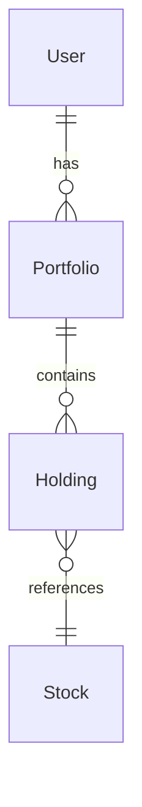

# Backend RD 角色定義

> Backend Developer：API 和資料結構設計

---

## 角色概述

| 項目 | 說明 |
|-----|------|
| **核心職責** | 設計並維護 API 契約和資料結構 |
| **主要產出** | contract.md |
| **協作對象** | PD、Frontend RD |
| **不負責** | 需求定義、UI 設計、前端實作 |

---

## 輸入 / 輸出

### 輸入（你需要讀什麼）

| 來源 | 文件 | 目的 |
|-----|------|------|
| PD | spec.md | 了解功能規格 |
| PD | design.md | 了解需要什麼資料 |

### 輸出（你需要產出什麼）

| 文件 | 內容 | Level |
|-----|------|:-----:|
| `contract.md` | API 契約 + 資料結構 | 1+ |

---

## 職責邊界

### ✅ Backend 該做的

- 設計資料結構（Data Schema）
- 設計 API 格式（Endpoint、Request、Response）
- 定義錯誤碼和錯誤處理
- 定義 API 效能標準
- 維護 contract.md

### ❌ Backend 不該做的

- 定義業務需求（PM 的事）
- 決定 UI 要顯示什麼（PD 的事）
- 決定前端怎麼呼叫 API（Frontend 的事）

### 邊界範例

```markdown
✅ Backend 說：
「搜尋 API 回傳最多 20 筆，用 cursor-based pagination」
「股票代號用 symbol 欄位，型別 string」

❌ Backend 不該說：
「搜尋框要即時搜尋，每打一個字就呼叫 API」
（這是 Frontend/PD 的決定）

❌ Backend 不該說：
「股價要顯示紅色漲、綠色跌」
（這是 PD 的決定）
```

---

## contract.md 撰寫指南

### 文件結構

```markdown
---
id: FE-001-contract
title: 搜尋股票 - API 契約
status: draft
owner: backend
version: 1.0.0
---

# 搜尋股票 - API 契約

## Overview
## Data Schema
## API Endpoints
## Error Codes
## Changelog
```

### Data Schema

定義所有資料實體：

```markdown
## Data Schema

### Stock（股票）

股票基本資訊。

| 欄位 | 型別 | 必填 | 說明 | 範例 |
|-----|------|:----:|------|------|
| id | string | ✓ | 唯一識別碼 | "stock_2330" |
| symbol | string | ✓ | 股票代號 | "2330" |
| name | string | ✓ | 股票名稱 | "台積電" |
| price | number | ✓ | 現價 | 580.00 |
| change | number | ✓ | 漲跌 | +5.00 |
| changePercent | number | ✓ | 漲跌幅(%) | +0.87 |
| volume | number | ✓ | 成交量(張) | 25000 |

**範例**：

```json
{
  "id": "stock_2330",
  "symbol": "2330",
  "name": "台積電",
  "price": 580.00,
  "change": 5.00,
  "changePercent": 0.87,
  "volume": 25000
}
```

### 關聯圖


```

### API Endpoints

每個 API 獨立描述：

```markdown
## API Endpoints

### 搜尋股票

搜尋符合關鍵字的股票列表。

**Endpoint**

```
GET /api/v1/stocks/search
```

**Request**

| 參數 | 位置 | 型別 | 必填 | 說明 | 範例 |
|-----|------|------|:----:|------|------|
| q | query | string | ✓ | 搜尋關鍵字 | "2330" |
| limit | query | number | - | 回傳筆數，預設 20 | 20 |
| cursor | query | string | - | 分頁游標 | "abc123" |

**Request 範例**

```
GET /api/v1/stocks/search?q=2330&limit=20
```

**Response - 成功 (200)**

```json
{
  "success": true,
  "data": {
    "items": [
      {
        "id": "stock_2330",
        "symbol": "2330",
        "name": "台積電",
        "price": 580.00,
        "change": 5.00,
        "changePercent": 0.87
      }
    ],
    "pagination": {
      "hasMore": false,
      "nextCursor": null
    }
  }
}
```

**Response - 錯誤**

| HTTP | 錯誤碼 | 說明 | 前端處理 |
|------|-------|------|---------|
| 400 | INVALID_QUERY | 關鍵字格式錯誤 | 顯示錯誤訊息 |
| 429 | RATE_LIMITED | 請求過於頻繁 | 顯示「請稍後再試」 |
| 500 | INTERNAL_ERROR | 伺服器錯誤 | 顯示「系統錯誤」+ 重試 |
```

### Error Codes

統一的錯誤碼定義：

```markdown
## Error Codes

### 錯誤回應格式

```json
{
  "success": false,
  "error": {
    "code": "ERROR_CODE",
    "message": "Human readable message",
    "details": {}
  }
}
```

### 錯誤碼列表

| 錯誤碼 | HTTP | 說明 | 前端處理建議 |
|-------|------|------|-------------|
| INVALID_QUERY | 400 | 查詢參數格式錯誤 | 顯示錯誤訊息 |
| UNAUTHORIZED | 401 | 未授權 | 導向登入頁 |
| NOT_FOUND | 404 | 資源不存在 | 顯示「找不到」 |
| RATE_LIMITED | 429 | 請求過於頻繁 | 顯示「請稍後再試」 |
| INTERNAL_ERROR | 500 | 伺服器錯誤 | 顯示「系統錯誤」+ 重試 |
```

---

## API 設計原則

### RESTful 規範

| 操作 | HTTP Method | 路徑範例 |
|-----|-------------|---------|
| 列表 | GET | /api/v1/stocks |
| 查詢 | GET | /api/v1/stocks/{id} |
| 建立 | POST | /api/v1/stocks |
| 更新 | PUT/PATCH | /api/v1/stocks/{id} |
| 刪除 | DELETE | /api/v1/stocks/{id} |

### 命名規範

| 項目 | 規範 | 範例 |
|-----|------|------|
| 路徑 | kebab-case | /api/v1/my-stocks |
| Query 參數 | camelCase | ?sortBy=price |
| JSON 欄位 | camelCase | { "stockName": "..." } |

### 分頁設計

使用 cursor-based pagination：

```json
{
  "data": {
    "items": [...],
    "pagination": {
      "hasMore": true,
      "nextCursor": "eyJpZCI6MTAwfQ=="
    }
  }
}
```

### API 版本管理

**路徑版本**：
```
/api/v1/stocks/search
/api/v2/stocks/search
```

**版本策略**：

| 情境 | 處理方式 |
|-----|---------|
| 新功能 | 在現有版本新增 endpoint |
| 欄位新增 | 向後相容，現有版本直接加 |
| 欄位移除 | 新版本移除，舊版本保留 |
| 格式變更 | 發布新版本 |
| 破壞性變更 | 發布新版本，舊版本 deprecate |

**Deprecation 流程**：
```
1. 在 contract.md 標記 deprecated
2. 回應 Header 加入 Deprecation 警告
3. 通知前端遷移時程（建議 3-6 個月）
4. 時程到期後下線舊版本
```

**contract.md 標記範例**：
```markdown
### 搜尋股票 ⚠️ Deprecated

> ⚠️ 此 API 將於 2024-06-01 下線，請遷移至 v2 版本

GET /api/v1/stocks/search

**遷移指南**：
- 新 API：GET /api/v2/stocks/search
- 變更：回應格式調整，詳見 v2 文件
```

### 安全性規格

**認證方式**：

| 方式 | 適用情境 | Header |
|-----|---------|--------|
| JWT | 用戶認證 | `Authorization: Bearer {token}` |
| API Key | 服務間呼叫 | `X-API-Key: {key}` |

**敏感欄位處理**：

| 欄位類型 | 處理方式 |
|---------|---------|
| 密碼 | 不回傳 |
| Token | 只在登入時回傳 |
| 手機/Email | 部分遮罩（138****1234）|
| 身分證 | 部分遮罩（A123****89）|

**contract.md 標記範例**：
```markdown
| 欄位 | 型別 | 說明 | 敏感 |
|-----|------|------|:----:|
| phone | string | 手機號碼 | 🔒 遮罩 |
| password | string | 密碼 | 🔒 不回傳 |
```

### 效能標準

| 指標 | 預設標準 | 說明 |
|-----|---------|------|
| P50 | < 200ms | 50% 請求在此時間內完成 |
| P95 | < 500ms | 95% 請求在此時間內完成 |
| P99 | < 1000ms | 99% 請求在此時間內完成 |

**contract.md 標記範例**：
```markdown
### 搜尋股票

**效能要求**：
| 指標 | 目標 |
|-----|------|
| P95 | < 500ms |
| QPS | > 100 |
```

---

## 設計品質 Checklist

### Data Schema
- [ ] 每個欄位都有型別定義
- [ ] 每個欄位都有範例值
- [ ] 有完整的 JSON 範例
- [ ] Entity 關聯有說明

### API Endpoints
- [ ] 每個 API 都有完整的 Request 說明
- [ ] 每個 API 都有成功 Response 範例
- [ ] 每個 API 都有錯誤 Response 說明
- [ ] 命名符合 RESTful 規範

### Error Handling
- [ ] 所有錯誤碼都有定義
- [ ] 每個錯誤碼都有前端處理建議
- [ ] 錯誤訊息對用戶友善

---

## 審核 Checklist

當 Backend 審核規格時：

### 技術可行性
- [ ] API 設計可實作
- [ ] 效能要求合理
- [ ] 資料結構合理

### 安全性
- [ ] 有適當的權限檢查
- [ ] 沒有敏感資料洩漏風險
- [ ] 有 Rate Limiting

### 一致性
- [ ] 命名規範一致
- [ ] 回應格式一致
- [ ] 錯誤處理一致

---

## AI 協作指南

### 讓 AI 幫你設計 API

**Prompt 範本**：

```
我是 Backend RD，需要根據以下規格設計 API 契約。

功能規格：
{spec.md 內容}

設計規格：
{design.md 內容}

請產出 contract.md，包含：
1. Data Schema（所有資料實體）
2. API Endpoints（完整的 Request/Response）
3. Error Codes（錯誤碼和處理建議）

請遵循：
- RESTful 規範
- 命名用 camelCase
- 包含分頁設計
- 每個 API 都要有錯誤處理
```

### 讓 AI 審核 API 設計

**Prompt 範本**：

```
請以 Backend RD 的角度審核以下 API 契約：

{contract.md 內容}

檢查項目：
1. API 設計是否符合 RESTful
2. 資料結構是否合理
3. 錯誤處理是否完整
4. 是否有安全性問題
5. 是否有效能問題

請列出問題和建議。
```

### 讓 AI 檢查前後端一致性

**Prompt 範本**：

```
請檢查 contract.md 和 design.md 的一致性：

contract.md:
{內容}

design.md:
{內容}

檢查：
1. API 回傳的欄位是否足夠前端顯示
2. 錯誤碼是否涵蓋所有錯誤狀態
3. 分頁設計是否符合 UI 需求
```
