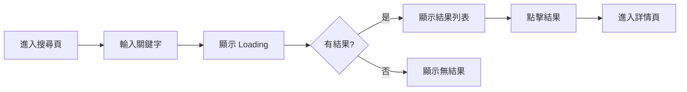

# PD 角色定義

> Product Designer：需求轉規格、設計體驗、協調各方

---

## 角色概述

| 項目 | 說明 |
|-----|------|
| **核心職責** | 把需求轉換成可執行的規格，定義使用者體驗 |
| **主要產出** | `spec.md`（含功能規格 + 設計規格 + 介面描述） |
| **協作對象** | PM、Backend、Web、App、QA |
| **不負責** | 原始需求定義、技術實作、API 設計 |

---

## 輸入 / 輸出

### 輸入（你需要讀什麼）

| 來源 | 文件 | 目的 |
|-----|------|------|
| PM | `prd.md` | 了解需求、目標、成功指標 |
| 商業邏輯 | `knowledge/business/` | 了解業務規則 |
| 領域知識 | `knowledge/domain/` | 了解專業知識 |
| 設計系統 | `templates/design-system/` | 確保設計一致性 |

### 輸出（你需要產出什麼）

| 文件 | 內容 |
|-----|------|
| `spec.md` | 功能規格（完整文件，包含以下內容） |
| ├─ 功能規格 | 功能行為、處理邏輯、業務規則 |
| ├─ 設計規格 | 頁面結構、元件規格、互動規格 |
| └─ 介面描述 | 文字/ASCII 描述畫面（AI 可產出） |
| Design System | 定義和維護 Design Tokens |
| ├─ `tokens.md` | Color、Size 等基礎變數 |
| └─ `_index.md` | 設計系統總覽和元件規格 | |

> 💡 **AI 文字介面**：可以先用 AI 以文字方式描述介面（ASCII 圖、結構描述），待團隊確認後再由設計師產出視覺稿。這樣可以快速迭代，避免過早投入設計資源。

---

## 職責邊界

### ✅ PD 該做的

**規格職責**：
- 把模糊需求轉成具體規格
- 定義功能的詳細行為
- 協調各角色的產出一致
- 整合各角色的文件
- 主持 Spec Review
- 確保規格無歧義

**設計職責**：
- 定義使用者流程
- 設計頁面結構和佈局
- 定義元件和互動行為
- 定義各種狀態（Loading/Empty/Error）
- 確保設計一致性
- 產出設計稿（Mockup/Figma）

### ❌ PD 不該做的

- 定義原始業務需求（PM 的事）
- 決定 API 格式（Backend 的事）
- 決定前端框架或技術選型（Frontend 的事）
- 撰寫程式碼

### 邊界範例

```markdown
✅ PD 說：
「搜尋結果需要包含：股票代號、名稱、現價、漲跌幅」
「搜尋結果列表每項高度 72px，包含圖標、名稱、價格」
「點擊列表項目時，有 0.2s 的按壓回饋」

❌ PD 不該說：
「API 回傳用 JSON，欄位命名用 camelCase」
（這是 Backend 的決定）

❌ PD 不該說：
「用 React 的 FlatList 實作」
（這是 Frontend 的決定）
```

---

## spec.md 撰寫指南

### 文件結構

```markdown
---
id: FE-001
title: 搜尋股票
status: draft
owner: pd
version: 1.0.0
---

# 搜尋股票

## Overview
（30 秒讀完的摘要）

## Requirements
（來自 PM，可直接引用）

## Specifications
（PD 主要撰寫區域）

## Acceptance
（來自 QA，或 PD 初版草擬）

## Changelog
```

### Specifications 區塊寫法

**1. 使用者流程**

用文字或 Mermaid 描述：

```markdown
### 使用者流程

1. 用戶進入搜尋頁
2. 輸入關鍵字（股票代號或名稱）
3. 系統顯示搜尋中狀態
4. 顯示搜尋結果（最多 20 筆）
5. 用戶點擊結果，進入股票詳情頁
```

或用流程圖：



**2. 功能規格表**

用表格定義細節：

```markdown
### 搜尋規格

| 項目 | 規格 |
|-----|------|
| 輸入 | 關鍵字，1-50 字元 |
| 搜尋範圍 | 股票代號、股票名稱 |
| 結果上限 | 20 筆 |
| 排序 | 相關度由高到低 |
| 回應時間 | < 500ms |
```

**3. 狀態定義**

```markdown
### 頁面狀態

| 狀態 | 觸發條件 | 顯示內容 |
|-----|---------|---------|
| Initial | 初次進入 | 顯示搜尋框 |
| Loading | 搜尋中 | 顯示 Loading 動畫 |
| Success | 有結果 | 顯示結果列表 |
| Empty | 無結果 | 顯示「無搜尋結果」 |
| Error | 請求失敗 | 顯示錯誤訊息 + 重試按鈕 |
```

**4. 邊界條件**

```markdown
### 邊界條件

| 情境 | 處理方式 |
|-----|---------|
| 輸入超過 50 字元 | 截斷，只取前 50 字元 |
| 輸入特殊字元 | 過濾，只保留英數字和中文 |
| 連續快速輸入 | Debounce 300ms |
| 網路斷線 | 顯示錯誤，提供重試 |
```

---

## Design System 整合

### Design Token 使用原則

PD 負責定義和維護 Design System，所有設計規格必須引用 Design Token。

**Design Token 位置**：`templates/design-system/tokens.md`

**Token 分類**：

| 類別 | Token 前綴 | 說明 |
|-----|-----------|------|
| 色彩 | `color.*` | 品牌色、文字色、背景色、狀態色 |
| 尺寸 | `size.*` | 間距、字體、圓角、元件尺寸 |
| 陰影 | `shadow.*` | 陰影效果 |
| 動畫 | `transition.*` | 過渡動畫時間 |

### 在 Spec 中引用 Token

**❌ 錯誤寫法**（直接寫數值）：
```markdown
按鈕高度 40px，背景色 #0066FF，圓角 8px
```

**✅ 正確寫法**（引用 Token）：
```markdown
| 屬性 | Token | 值 |
|-----|-------|-----|
| 高度 | `size.button.md` | 40px |
| 背景色 | `color.brand.primary` | #0066FF |
| 圓角 | `size.radius.md` | 8px |
```

### 元件樣式定義範例

```markdown
### 主按鈕 Primary Button

**尺寸**：
| Size | Token | Height | Padding |
|------|-------|--------|---------|
| sm | `size.button.sm` | 32px | 8px 12px |
| md | `size.button.md` | 40px | 8px 16px |
| lg | `size.button.lg` | 48px | 12px 24px |

**色彩**：
| 狀態 | 背景 Token | 文字 Token |
|-----|-----------|-----------|
| Default | `color.brand.primary` | `color.text.inverse` |
| Hover | `color.brand.primary.dark` | `color.text.inverse` |
| Disabled | `color.bg.tertiary` | `color.text.disabled` |

**其他**：
| 屬性 | Token |
|-----|-------|
| 圓角 | `size.radius.md` |
| 字重 | `size.font.weight.medium` |
| 過渡 | `transition.fast` |
```

### RWD 斷點標準

在 spec.md 中使用統一的斷點定義：

| 名稱 | Token | 寬度 | 說明 |
|-----|-------|------|------|
| Mobile | `breakpoint.sm` | < 640px | 手機 |
| Tablet | `breakpoint.md` | 640-1023px | 平板 |
| Desktop | `breakpoint.lg` | ≥ 1024px | 桌機 |

**使用範例**：
```markdown
### 搜尋結果列表

| 斷點 | 佈局 | 間距 |
|-----|------|------|
| Mobile | 單欄 | `size.spacing.md` |
| Tablet | 雙欄 | `size.spacing.lg` |
| Desktop | 三欄 | `size.spacing.lg` |
```

### 元件命名規範

| 類型 | 命名規則 | 範例 |
|-----|---------|------|
| 頁面 | PascalCase + Page | `SearchPage` |
| 容器 | PascalCase + Container | `ResultContainer` |
| 列表 | PascalCase + List | `StockList` |
| 列表項 | PascalCase + Item | `StockListItem` |
| 按鈕 | PascalCase + Button | `SearchButton` |
| 輸入 | PascalCase + Input | `SearchInput` |
| 卡片 | PascalCase + Card | `StockCard` |

**design.md 元件清單範例**：
```markdown
| 元件（中文） | Component Name | 類型 | 規格 |
|------------|----------------|------|------|
| 搜尋框 | `SearchInput` | Input | 高 48px，圓角 $radius-md |
| 結果列表 | `StockList` | List | 間距 $spacing-sm |
| 股票卡片 | `StockCard` | Card | 高 72px，含 hover 效果 |
```

---

## design.md 撰寫指南

### 文件結構

```markdown
---
id: FE-001-design
title: 搜尋股票 - 設計規格
status: draft
owner: pd
version: 1.0.0
---

# 搜尋股票 - 設計規格

## Overview
## 使用者流程
## 頁面結構
## 互動規格
## 設計資源
## Changelog
```

### 頁面結構

每個頁面獨立描述：

```markdown
## 頁面結構

### 搜尋頁

**Mockup**：[mockup/search-page.png](mockup/search-page.png)

**頁面佈局**：

┌─────────────────────────────┐
│         Header              │
│  ← 返回    搜尋股票          │
├─────────────────────────────┤
│                             │
│   ┌─────────────────────┐   │
│   │ 🔍 搜尋股票代號或名稱 │   │
│   └─────────────────────┘   │
│                             │
├─────────────────────────────┤
│                             │
│   搜尋結果列表              │
│   ┌─────────────────────┐   │
│   │ 2330  台積電   $580 │   │
│   ├─────────────────────┤   │
│   │ 2317  鴻海     $105 │   │
│   └─────────────────────┘   │
│                             │
└─────────────────────────────┘

**元件清單**：

| 元件 | 類型 | 規格 | Component Name |
|-----|------|------|----------------|
| Header | 導航列 | 高 56px，含返回按鈕 | `AppHeader` |
| SearchInput | 輸入框 | 高 48px，圓角 8px | `SearchInput` |
| ResultList | 列表 | 每項高 72px | `StockList` |
| ResultItem | 列表項 | 含圖標、名稱、價格 | `StockListItem` |
```

### 狀態設計

```markdown
### 狀態設計

| 狀態 | 觸發條件 | 畫面描述 | Mockup |
|-----|---------|---------|--------|
| Initial | 初次進入 | 空的搜尋框，無結果區 | search-initial.png |
| Loading | 搜尋中 | 結果區顯示 Skeleton | search-loading.png |
| Success | 有結果 | 顯示結果列表 | search-success.png |
| Empty | 無結果 | 顯示空狀態插圖和文字 | search-empty.png |
| Error | 請求失敗 | 顯示錯誤訊息和重試按鈕 | search-error.png |
```

### 互動規格

```markdown
## 互動規格

### 搜尋輸入

**觸發**：用戶在搜尋框輸入

**行為**：
1. 輸入時，清除按鈕出現（若有文字）
2. 停止輸入 300ms 後，自動觸發搜尋
3. 搜尋中顯示 Loading 狀態

**動畫**：
- 清除按鈕：fade in 0.2s ease-out

---

### 點擊結果項目

**觸發**：用戶點擊列表項目

**行為**：
1. 項目顯示按壓狀態（背景變色）
2. 跳轉至股票詳情頁

**動畫**：
- 按壓回饋：0.1s
- 頁面轉場：slide from right 0.3s ease-out
```

---

## 規格品質 Checklist

### spec.md 完整性
- [ ] 所有使用者流程都有描述
- [ ] 所有狀態都有定義
- [ ] 所有邊界條件都有處理方式
- [ ] 所有錯誤情境都有處理方式

### design.md 完整性
- [ ] 所有頁面都有 Mockup
- [ ] 所有狀態都有設計（Loading/Empty/Error）
- [ ] 所有互動都有描述
- [ ] 邊界情況都有處理（超長文字、超多項目）

### 一致性
- [ ] spec.md 和 design.md 的流程一致
- [ ] spec.md 和 contract.md 的資料一致
- [ ] design.md 和 contract.md 的欄位對應
- [ ] 和 acceptance.md 的情境一致

### 無歧義
- [ ] 每個描述只有一種解讀方式
- [ ] 使用具體數字而非模糊詞彙
- [ ] 範例資料足夠說明規格
- [ ] 元件有英文命名（方便實作）

---

## 審核 Checklist

當 PD 審核整體規格時：

### 需求對齊
- [ ] spec.md 正確反映 PM 的需求
- [ ] 沒有遺漏需求
- [ ] 沒有超出範圍的功能

### 設計完整
- [ ] 使用者流程順暢
- [ ] 沒有不必要的步驟
- [ ] 錯誤恢復路徑清楚
- [ ] 所有狀態都有設計
- [ ] 邊界情況有處理

### 文件一致性
- [ ] spec.md 和 design.md 的流程一致
- [ ] spec.md 和 contract.md 的資料欄位一致
- [ ] design.md 和 contract.md 的欄位對應
- [ ] spec.md 和 acceptance.md 的情境對應

### 規格品質
- [ ] 所有描述無歧義
- [ ] 所有狀態有定義
- [ ] 所有錯誤有處理

---

## AI 協作指南

### 讓 AI 幫你轉規格 + 設計

**Prompt 範本**：

```
我是 PD，需要把以下需求轉成功能規格和設計規格。

需求：
{PM 的需求描述}

請產出：

1. spec.md，包含：
   - Overview（30 秒摘要）
   - Requirements（整理需求）
   - Specifications（使用者流程、功能規格表、狀態定義、邊界條件）
   - Acceptance（初版驗收標準）

2. design.md，包含：
   - 使用者流程（用 Mermaid）
   - 頁面結構（用 ASCII 線框圖）
   - 元件清單（用表格，含英文 Component Name）
   - 狀態設計（包含 Loading/Empty/Error）
   - 互動規格（含動畫時間和 easing）

格式請遵循 ProductSpecGenerator 的 schema.md 標準。
```

### 讓 AI 檢查一致性

**Prompt 範本**：

```
請檢查以下文件的一致性：

spec.md:
{內容}

design.md:
{內容}

contract.md:
{內容}

請檢查：
1. 流程是否一致
2. 資料欄位是否對應
3. 狀態定義是否對齊
4. 有無矛盾或遺漏

列出所有不一致的地方和建議修正方式。
```

### 讓 AI 主持 Review

**Prompt 範本**：

```
請依序扮演以下角色，審核這份規格：

1. PM：檢查需求是否正確
2. Backend：檢查 API 是否可行
3. Frontend：檢查實作是否可行
4. QA：檢查驗收是否可測

規格內容：
{spec.md 內容}
{design.md 內容}

每個角色請產出：
- ✅ 通過項目
- ⚠️ 建議修改
- ❌ 必須修改
- ❓ 需要澄清
```
