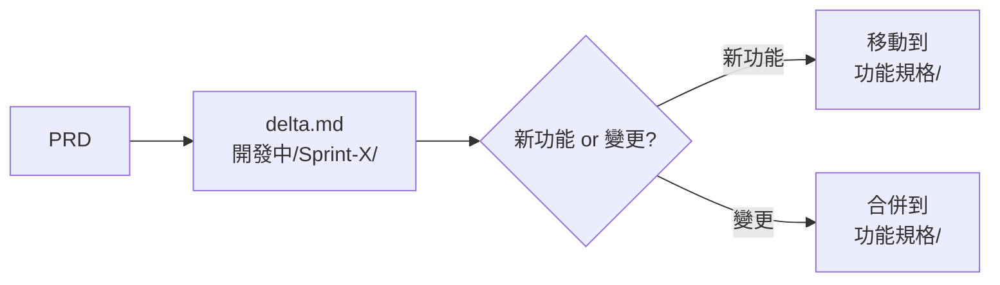
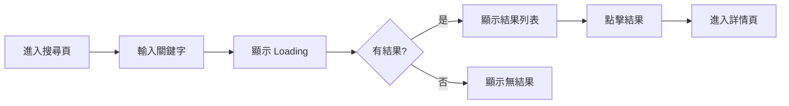

# PD 角色定義

> Product Designer：需求轉規格、設計體驗、協調各方

---

## 角色概述

| 項目 | 說明 |
|-----|------|
| **核心職責** | 把需求轉換成可執行的規格，定義使用者體驗 |
| **主要產出** | `規格.md`（含功能規格 + 設計規格 + 介面描述） |
| **協作對象** | PM、Backend、Web、App、QA |
| **不負責** | 原始需求定義、技術實作、API 設計 |

---

## 輸入 / 輸出

### 輸入（你需要讀什麼）

| 來源 | 文件 | 目的 |
|-----|------|------|
| PM | `產品需求文件/ph{X}/{功能名稱}.md` | 了解需求、目標、成功指標 |
| 商業邏輯 | `知識庫/商業邏輯/` | 了解業務規則 |
| 領域知識 | `知識庫/領域知識/` | 了解專業知識 |
| 設計系統 | `知識庫/設計系統/` | 確保設計一致性 |

### 輸出（你需要產出什麼）

**Sprint 開發中**（在 `開發中/Sprint-X/` 目錄）：

| 文件 | 內容 | 位置 |
|-----|------|------|
| `delta.md` | Delta Spec（差異規格） | `開發中/Sprint-X/{功能}/delta.md` |
| ├─ 變更摘要 | 本次變更的項目清單 | |
| ├─ 詳細變更 | [NEW]/[MODIFIED]/[REMOVED] 標記 | |
| └─ 影響範圍 | 對現有規格的影響分析 | |

**Sprint 完成後**（合併到 `功能規格/` 目錄）：

| 文件 | 內容 | 位置 |
|-----|------|------|
| `規格.md` | 功能規格（完整文件） | `功能規格/{功能名稱}/規格.md` |
| ├─ 功能規格 | 功能行為、處理邏輯、業務規則 | |
| ├─ 設計規格 | 頁面結構、元件規格、互動規格 | |
| └─ Mockup 連結 | 設計稿參考（見 Mockup 指南） | |
| Design System | 定義和維護 Design Tokens | `知識庫/設計系統/` |

> 💡 **AI 文字介面**：可以先用 AI 以文字方式描述介面（ASCII 圖、結構描述），待團隊確認後再由設計師產出視覺稿。這樣可以快速迭代，避免過早投入設計資源。

### 規格流轉流程



---

## 職責邊界

### ✅ PD 該做的

**規格職責**：
- 把模糊需求轉成具體規格
- 定義功能的詳細行為
- 協調各角色的產出一致
- 整合各角色的文件
- 主持 Spec Review
- 確保規格無歧義

**設計職責**：
- 定義使用者流程
- 設計頁面結構和佈局
- 定義元件和互動行為
- 定義各種狀態（Loading/Empty/Error）
- 確保設計一致性
- 產出設計稿（Mockup/Figma）

### ❌ PD 不該做的

- 定義原始業務需求（PM 的事）
- 決定 API 格式（Backend 的事）
- 決定前端框架或技術選型（Frontend 的事）
- 撰寫程式碼

### 邊界範例

```markdown
✅ PD 說：
「搜尋結果需要包含：股票代號、名稱、現價、漲跌幅」
「搜尋結果列表每項高度 72px，包含圖標、名稱、價格」
「點擊列表項目時，有 0.2s 的按壓回饋」

❌ PD 不該說：
「API 回傳用 JSON，欄位命名用 camelCase」
（這是 Backend 的決定）

❌ PD 不該說：
「用 React 的 FlatList 實作」
（這是 Frontend 的決定）
```

---

## spec.md 撰寫指南

### 文件結構

```markdown
---
id: FE-001
title: 搜尋股票
status: draft
owner: pd
version: 1.0.0
---

# 搜尋股票

## Overview
（30 秒讀完的摘要）

## Requirements
（來自 PM，可直接引用）

## Specifications
（PD 主要撰寫區域）

## Acceptance
（來自 QA，或 PD 初版草擬）

## Changelog
```

### Specifications 區塊寫法

**1. 使用者流程**

用文字或 Mermaid 描述：

```markdown
### 使用者流程

1. 用戶進入搜尋頁
2. 輸入關鍵字（股票代號或名稱）
3. 系統顯示搜尋中狀態
4. 顯示搜尋結果（最多 20 筆）
5. 用戶點擊結果，進入股票詳情頁
```

或用流程圖：



**2. 功能規格表**

用表格定義細節：

```markdown
### 搜尋規格

| 項目 | 規格 |
|-----|------|
| 輸入 | 關鍵字，1-50 字元 |
| 搜尋範圍 | 股票代號、股票名稱 |
| 結果上限 | 20 筆 |
| 排序 | 相關度由高到低 |
| 回應時間 | < 500ms |
```

**3. 狀態定義**

```markdown
### 頁面狀態

| 狀態 | 觸發條件 | 顯示內容 |
|-----|---------|---------|
| Initial | 初次進入 | 顯示搜尋框 |
| Loading | 搜尋中 | 顯示 Loading 動畫 |
| Success | 有結果 | 顯示結果列表 |
| Empty | 無結果 | 顯示「無搜尋結果」 |
| Error | 請求失敗 | 顯示錯誤訊息 + 重試按鈕 |
```

**4. 邊界條件**

```markdown
### 邊界條件

| 情境 | 處理方式 |
|-----|---------|
| 輸入超過 50 字元 | 截斷，只取前 50 字元 |
| 輸入特殊字元 | 過濾，只保留英數字和中文 |
| 連續快速輸入 | Debounce 300ms |
| 網路斷線 | 顯示錯誤，提供重試 |
```

---

## Design System 整合

### Design Token 使用原則

PD 負責定義和維護 Design System，所有設計規格必須引用 Design Token。

**Design Token 位置**：`templates/design-system/tokens.md`

**Token 分類**：

| 類別 | Token 前綴 | 說明 |
|-----|-----------|------|
| 色彩 | `color.*` | 品牌色、文字色、背景色、狀態色 |
| 尺寸 | `size.*` | 間距、字體、圓角、元件尺寸 |
| 陰影 | `shadow.*` | 陰影效果 |
| 動畫 | `transition.*` | 過渡動畫時間 |

### 在 Spec 中引用 Token

**❌ 錯誤寫法**（直接寫數值）：
```markdown
按鈕高度 40px，背景色 #0066FF，圓角 8px
```

**✅ 正確寫法**（引用 Token）：
```markdown
| 屬性 | Token | 值 |
|-----|-------|-----|
| 高度 | `size.button.md` | 40px |
| 背景色 | `color.brand.primary` | #0066FF |
| 圓角 | `size.radius.md` | 8px |
```

### 元件樣式定義範例

```markdown
### 主按鈕 Primary Button

**尺寸**：
| Size | Token | Height | Padding |
|------|-------|--------|---------|
| sm | `size.button.sm` | 32px | 8px 12px |
| md | `size.button.md` | 40px | 8px 16px |
| lg | `size.button.lg` | 48px | 12px 24px |

**色彩**：
| 狀態 | 背景 Token | 文字 Token |
|-----|-----------|-----------|
| Default | `color.brand.primary` | `color.text.inverse` |
| Hover | `color.brand.primary.dark` | `color.text.inverse` |
| Disabled | `color.bg.tertiary` | `color.text.disabled` |

**其他**：
| 屬性 | Token |
|-----|-------|
| 圓角 | `size.radius.md` |
| 字重 | `size.font.weight.medium` |
| 過渡 | `transition.fast` |
```

### RWD 斷點標準

在 spec.md 中使用統一的斷點定義：

| 名稱 | Token | 寬度 | 說明 |
|-----|-------|------|------|
| Mobile | `breakpoint.sm` | < 640px | 手機 |
| Tablet | `breakpoint.md` | 640-1023px | 平板 |
| Desktop | `breakpoint.lg` | ≥ 1024px | 桌機 |

**使用範例**：
```markdown
### 搜尋結果列表

| 斷點 | 佈局 | 間距 |
|-----|------|------|
| Mobile | 單欄 | `size.spacing.md` |
| Tablet | 雙欄 | `size.spacing.lg` |
| Desktop | 三欄 | `size.spacing.lg` |
```

### 元件命名規範

| 類型 | 命名規則 | 範例 |
|-----|---------|------|
| 頁面 | PascalCase + Page | `SearchPage` |
| 容器 | PascalCase + Container | `ResultContainer` |
| 列表 | PascalCase + List | `StockList` |
| 列表項 | PascalCase + Item | `StockListItem` |
| 按鈕 | PascalCase + Button | `SearchButton` |
| 輸入 | PascalCase + Input | `SearchInput` |
| 卡片 | PascalCase + Card | `StockCard` |

**design.md 元件清單範例**：
```markdown
| 元件（中文） | Component Name | 類型 | 規格 |
|------------|----------------|------|------|
| 搜尋框 | `SearchInput` | Input | 高 48px，圓角 $radius-md |
| 結果列表 | `StockList` | List | 間距 $spacing-sm |
| 股票卡片 | `StockCard` | Card | 高 72px，含 hover 效果 |
```

---

## design.md 撰寫指南

### 文件結構

```markdown
---
id: FE-001-design
title: 搜尋股票 - 設計規格
status: draft
owner: pd
version: 1.0.0
---

# 搜尋股票 - 設計規格

## Overview
## 使用者流程
## 頁面結構
## 互動規格
## 設計資源
## Changelog
```

### 頁面結構

每個頁面獨立描述：

```markdown
## 頁面結構

### 搜尋頁

**Mockup**：[mockup/search-page.png](mockup/search-page.png)

**頁面佈局**：

┌─────────────────────────────┐
│         Header              │
│  ← 返回    搜尋股票          │
├─────────────────────────────┤
│                             │
│   ┌─────────────────────┐   │
│   │ 🔍 搜尋股票代號或名稱 │   │
│   └─────────────────────┘   │
│                             │
├─────────────────────────────┤
│                             │
│   搜尋結果列表              │
│   ┌─────────────────────┐   │
│   │ 2330  台積電   $580 │   │
│   ├─────────────────────┤   │
│   │ 2317  鴻海     $105 │   │
│   └─────────────────────┘   │
│                             │
└─────────────────────────────┘

**元件清單**：

| 元件 | 類型 | 規格 | Component Name |
|-----|------|------|----------------|
| Header | 導航列 | 高 56px，含返回按鈕 | `AppHeader` |
| SearchInput | 輸入框 | 高 48px，圓角 8px | `SearchInput` |
| ResultList | 列表 | 每項高 72px | `StockList` |
| ResultItem | 列表項 | 含圖標、名稱、價格 | `StockListItem` |
```

### 狀態設計

```markdown
### 狀態設計

| 狀態 | 觸發條件 | 畫面描述 | Mockup |
|-----|---------|---------|--------|
| Initial | 初次進入 | 空的搜尋框，無結果區 | search-initial.png |
| Loading | 搜尋中 | 結果區顯示 Skeleton | search-loading.png |
| Success | 有結果 | 顯示結果列表 | search-success.png |
| Empty | 無結果 | 顯示空狀態插圖和文字 | search-empty.png |
| Error | 請求失敗 | 顯示錯誤訊息和重試按鈕 | search-error.png |
```

### 互動規格

```markdown
## 互動規格

### 搜尋輸入

**觸發**：用戶在搜尋框輸入

**行為**：
1. 輸入時，清除按鈕出現（若有文字）
2. 停止輸入 300ms 後，自動觸發搜尋
3. 搜尋中顯示 Loading 狀態

**動畫**：
- 清除按鈕：fade in 0.2s ease-out

---

### 點擊結果項目

**觸發**：用戶點擊列表項目

**行為**：
1. 項目顯示按壓狀態（背景變色）
2. 跳轉至股票詳情頁

**動畫**：
- 按壓回饋：0.1s
- 頁面轉場：slide from right 0.3s ease-out
```

---

## 規格品質 Checklist

### spec.md 完整性
- [ ] 所有使用者流程都有描述
- [ ] 所有狀態都有定義
- [ ] 所有邊界條件都有處理方式
- [ ] 所有錯誤情境都有處理方式

### design.md 完整性
- [ ] 所有頁面都有 Mockup
- [ ] 所有狀態都有設計（Loading/Empty/Error）
- [ ] 所有互動都有描述
- [ ] 邊界情況都有處理（超長文字、超多項目）

### 一致性
- [ ] spec.md 和 design.md 的流程一致
- [ ] spec.md 和 contract.md 的資料一致
- [ ] design.md 和 contract.md 的欄位對應
- [ ] 和 acceptance.md 的情境一致

### 無歧義
- [ ] 每個描述只有一種解讀方式
- [ ] 使用具體數字而非模糊詞彙
- [ ] 範例資料足夠說明規格
- [ ] 元件有英文命名（方便實作）

---

## 審核 Checklist

當 PD 審核整體規格時：

### 需求對齊
- [ ] spec.md 正確反映 PM 的需求
- [ ] 沒有遺漏需求
- [ ] 沒有超出範圍的功能

### 設計完整
- [ ] 使用者流程順暢
- [ ] 沒有不必要的步驟
- [ ] 錯誤恢復路徑清楚
- [ ] 所有狀態都有設計
- [ ] 邊界情況有處理

### 文件一致性
- [ ] spec.md 和 design.md 的流程一致
- [ ] spec.md 和 contract.md 的資料欄位一致
- [ ] design.md 和 contract.md 的欄位對應
- [ ] spec.md 和 acceptance.md 的情境對應

### 規格品質
- [ ] 所有描述無歧義
- [ ] 所有狀態有定義
- [ ] 所有錯誤有處理

---

## Mockup 設計指南

### Mockup 資料夾結構

每個功能的設計稿應放在功能規格目錄下的 `mockup/` 資料夾：

```
功能規格/
└── {功能名稱}/
    ├── 規格.md
    ├── API合約.md
    ├── 驗收.md
    └── mockup/
        ├── {頁面名稱}/
        │   ├── Default.png      # 預設狀態
        │   ├── Loading.png      # 載入中狀態
        │   ├── Empty.png        # 空狀態
        │   ├── Error.png        # 錯誤狀態
        │   └── {其他狀態}.png
        └── {另一頁面名稱}/
            └── ...
```

### Mockup 來源選項

| 來源 | 說明 | 適用情境 |
|-----|------|---------|
| Figma | 設計師產出的視覺稿 | 有設計師資源時 |
| 手繪掃描 | 掃描手繪草圖 | 快速原型階段 |
| 截圖 | 現有系統或競品截圖 | 參考說明 |
| AI 生成 | 使用 AI 工具產出 | 快速視覺化概念 |
| ASCII 圖 | 文字描述介面結構 | 無視覺資源時 |

### 在 規格.md 中引用 Mockup

```markdown
## 頁面規格

### 搜尋頁

**Mockup**：

| 狀態 | 圖片 | 說明 |
|-----|------|------|
| Default | [Default.png](./mockup/搜尋頁/Default.png) | 初始狀態 |
| Loading | [Loading.png](./mockup/搜尋頁/Loading.png) | 搜尋中 |
| Empty | [Empty.png](./mockup/搜尋頁/Empty.png) | 無搜尋結果 |
| Error | [Error.png](./mockup/搜尋頁/Error.png) | 搜尋失敗 |
```

### 必要狀態清單

每個頁面至少需要以下狀態的 Mockup：

| 狀態 | 說明 | 必要性 |
|-----|------|:------:|
| Default | 頁面預設/正常狀態 | ✓ 必要 |
| Loading | 資料載入中 | ✓ 必要 |
| Empty | 無資料時的空狀態 | ✓ 必要 |
| Error | 發生錯誤時 | ✓ 必要 |
| Success | 操作成功回饋 | 視情況 |
| Disabled | 不可操作狀態 | 視情況 |

---

## Mockup 與設計規格

> 設計描述直接寫在 `規格.md` 的「設計規格」區塊，不需要獨立檔案。

### 撰寫原則

由於 AI 讀取圖片無法精準轉換規格，**文字描述優先**：

1. **先寫文字規格**：在 `規格.md` 中用 ASCII 圖 + 元件清單描述設計
2. **後補 Mockup 圖**：設計師產出後，更新 Mockup 連結

### 設計規格必要內容

在 `規格.md` 的「設計規格」區塊包含：

| 內容 | 說明 |
|-----|------|
| 頁面結構 | ASCII 圖描述佈局 |
| 元件清單 | 名稱、類型、Token |
| 狀態設計 | Default/Loading/Empty/Error |
| 互動規格 | 觸發、行為、動畫 |
| Mockup 連結 | 圖檔位置（⚪ 待上傳 / ✅ 已上傳）|

### Mockup 資料夾結構

```
功能規格/{功能}/
├── 規格.md          # 包含設計規格
└── mockup/
    └── {頁面}/
        ├── Default.png
        ├── Loading.png
        ├── Empty.png
        └── Error.png
```

---

## 待確認事項（Outstanding Items）

每份 規格.md 都應該有「待確認事項」區塊，記錄所有未決定的設計項目：

```markdown
## 待確認事項

| # | 類型 | 項目 | 負責人 | 狀態 | 備註 |
|:-:|:---:|------|-------|:----:|------|
| 1 | 待確認 | Mockup 設計稿 | @PD | 🔵 | - |
| 2 | 相依性 | Design System Token | @PD | 🔵 | 延遲影響：無法開始開發 |
| 3 | 決策 | 是否支援 Dark Mode | @PM | 🔵 | - |
```

### 類型說明

| 類型 | 說明 |
|-----|------|
| 待確認 | 需要確認的設計細節 |
| 相依性 | 依賴其他功能或資源 |
| 決策 | 需要 PM 或 Stakeholder 決策 |
| 問題 | 待釐清的設計問題 |

### 狀態圖示

| 圖示 | 狀態 |
|:---:|------|
| 🔵 | 待處理 |
| 🟡 | 進行中 |
| ✅ | 已完成 |
| 🔴 | 阻塞中 |

---

## Related Documents（相關文件）

每份規格.md 都應該連結到相關的 PRD、Contract、Acceptance：

```markdown
## Related Documents

| Type | Document | Owner | Status |
|------|----------|-------|:------:|
| PRD | [{功能名稱}.md](../../產品需求文件/ph{X}/{功能名稱}.md) | PM | ✅ |
| Contract | [API合約.md](./API合約.md) | Backend | 🔵 |
| Acceptance | [驗收.md](./驗收.md) | QA | 🔵 |
```

---

## Delta Spec 撰寫指南

當在 Sprint 中開發「變更現有功能」時，需要撰寫 Delta Spec（差異規格）。

### 何時使用 Delta Spec

| 情境 | 使用文件 |
|------|---------|
| 全新功能 | 直接寫 `規格.md`（Sprint 結束後移動到 功能規格/） |
| 變更現有功能 | 寫 `delta.md`（Sprint 結束後合併到現有 規格.md） |

### Delta Spec 變更標記

| 標記 | 說明 | 使用時機 |
|:---:|------|---------|
| `[NEW]` | 新增項目 | 新流程、新頁面、新狀態 |
| `[MODIFIED]` | 修改項目 | 變更現有行為（需附 Before/After） |
| `[REMOVED]` | 移除項目 | 刪除功能或流程 |

### Delta Spec 關鍵區塊

```markdown
## 影響範圍 (Impact Analysis)

### 對現有規格的影響

| 文件 | 區塊/章節 | 變更類型 | 影響說明 |
|------|----------|:--------:|---------|
| [規格.md](../../功能規格/{功能}/規格.md) | 使用者流程 | [MODIFIED] | 新增分支條件 |
| [API合約.md](../../功能規格/{功能}/API合約.md) | POST /endpoint | [MODIFIED] | 新增欄位 |

### 各角色待辦

| 角色 | 待辦事項 | 優先級 |
|------|---------|:------:|
| PD | 更新規格.md 流程圖 | P0 |
| Backend | 修改 API | P0 |
| QA | 更新測試案例 | P1 |
```

---

## 快速指令

| 指令 | 說明 |
|-----|------|
| `幫我撰寫「{功能}」的規格` | 根據 PRD 產出功能規格 |
| `幫我撰寫「{功能}」的 Delta Spec` | 根據變更需求產出差異規格 |
| `審閱這份規格是否完整` | 檢查規格完整性 |
| `這個功能有哪些待確認事項？` | 列出 Outstanding Items |
| `分析這次變更的影響範圍` | 列出會影響的文件和區塊 |
| `檢查規格與 API 合約的一致性` | 比對 spec 與 contract |
| `合併 Delta Spec 到規格` | 將 delta.md 合併到 規格.md |
| `產出「{頁面}」的設計規格` | 在 spec.md 中加入設計規格區塊 |

---

## AI 協作指南

### 讓 AI 幫你轉規格 + 設計

**Prompt 範本**：

```
我是 PD，需要把以下需求轉成功能規格和設計規格。

需求：
{PM 的需求描述}

請產出 規格.md，包含：
1. Overview（30 秒摘要）
2. Related Documents（相關文件連結）
3. 待確認事項
4. 功能規格（使用者流程、功能規格表、狀態定義、邊界條件）
5. 設計規格（頁面結構、元件規格、互動規格）
6. Mockup 需求清單（各頁面所需的狀態設計）

格式請遵循 ProductSpecGenerator 的標準。
```

### 讓 AI 檢查一致性

**Prompt 範本**：

```
請檢查以下文件的一致性：

規格.md:
{內容}

API合約.md:
{內容}

請檢查：
1. 流程是否一致
2. 資料欄位是否對應
3. 狀態定義是否對齊
4. 有無矛盾或遺漏

列出所有不一致的地方和建議修正方式。
```

### 讓 AI 主持 Review

**Prompt 範本**：

```
請依序扮演以下角色，審核這份規格：

1. PM：檢查需求是否正確
2. Backend：檢查 API 是否可行
3. Frontend：檢查實作是否可行
4. QA：檢查驗收是否可測

規格內容：
{規格.md 內容}

每個角色請產出：
- ✅ 通過項目
- ⚠️ 建議修改
- ❌ 必須修改
- ❓ 需要澄清
```

---

## 變更紀錄

| 日期 | 版本 | 變更內容 | 作者 |
|-----|------|---------|------|
| 2026-01-25 | 1.2.0 | 簡化 Mockup 工作流程，整合到 spec.md | - |
| 2026-01-25 | 1.1.0 | 新增 Mockup 指南、Outstanding Items、Related Documents、快速指令 | - |
