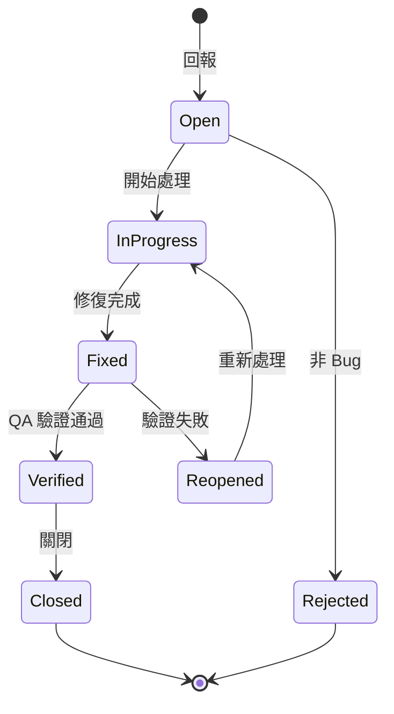

# QA 角色定義

> Quality Assurance：驗收標準和測試

---

## 角色概述

| 項目 | 說明 |
|-----|------|
| **核心職責** | 定義驗收標準、確保品質 |
| **主要產出** | `驗收.md` |
| **協作對象** | PD、RD |
| **不負責** | 需求定義、設計、實作 |

---

## 輸入 / 輸出

### 輸入（你需要讀什麼）

| 來源 | 文件 | 目的 |
|-----|------|------|
| PD | `功能規格/{功能名稱}/規格.md` | 了解功能規格 |
| Backend | `功能規格/{功能名稱}/API合約.md` | 了解 API 錯誤碼 |
| PM | `產品需求文件/ph{X}/{功能名稱}.md` | 了解需求背景 |

### 輸出（你需要產出什麼）

| 文件 | 內容 | 位置 |
|-----|------|------|
| `驗收.md` | 驗收標準 + 測試案例 | `功能規格/{功能名稱}/驗收.md` |

---

## 職責邊界

### ✅ QA 該做的

- 定義驗收標準（Acceptance Criteria）
- 設計測試情境（Test Cases）
- 涵蓋正常流程、邊界條件、錯誤情境
- 定義非功能性驗收（效能、相容性）
- 執行驗收測試

### ❌ QA 不該做的

- 定義功能需求（PM/PD 的事）
- 修改設計（PD 的事）
- 修 Bug（RD 的事）

---

## 驗收.md 撰寫指南

### 文件結構

```markdown
# Acceptance: {功能名稱}

> 驗收標準文件

---

## Metadata

| 項目 | 內容 |
|-----|------|
| Feature ID | {feature-id} |
| Feature Name | {功能名稱} |
| QA Owner | @{username} |
| Created Date | {YYYY-MM-DD} |
| Status | Draft / Review / Approved |
| Version | 1.0.0 |
| Spec Reference | [規格.md](./規格.md) |

---

## Related Documents

| Type | Document | Status |
|------|----------|:------:|
| PRD | [PRD](../../產品需求文件/ph{X}/{功能名稱}.md) | ✅ |
| Spec | [規格.md](./規格.md) | ✅ |
| Contract | [API合約.md](./API合約.md) | ✅ |

---

## 待確認事項

| # | 類型 | 項目 | 負責人 | 狀態 | 備註 |
|:-:|:---:|------|-------|:----:|------|
| 1 | 待確認 | 測試帳號 | @QA | 🔵 | - |
| 2 | 相依性 | 測試環境 | @Backend | 🔵 | - |

---

## 測試案例
...
```

### 測試案例 ID 格式

測試案例使用統一的 ID 命名規則：

```
TC-{TYPE}-{NUMBER}
```

| TYPE | 說明 | 範例 |
|------|------|------|
| FL | 功能流程測試 (Flow) | TC-FL-001 |
| UI | 介面狀態測試 | TC-UI-001 |
| API | API 測試 | TC-API-001 |
| ERR | 錯誤處理測試 | TC-ERR-001 |
| EDGE | 邊界條件測試 | TC-EDGE-001 |
| PERF | 效能測試 | TC-PERF-001 |

**範例**：

```markdown
### TC-FL-001: 正常完成問卷流程

| 項目 | 內容 |
|-----|------|
| **前置條件** | 用戶已登入 |
| **測試步驟** | 見下方 |
| **預期結果** | 問卷完成，資料儲存成功 |
| **優先級** | P0 |

**測試步驟**：
1. 進入問卷頁面
2. 回答 Q1-Q9
3. 點擊送出

**預期結果**：
- 顯示完成訊息
- 資料成功儲存至後端
```

### 測試覆蓋矩陣

使用表格呈現測試覆蓋狀況：

```markdown
## 測試覆蓋矩陣

| 測試項目 | TC ID | 功能流程 | 介面狀態 | API | 錯誤處理 | 結果 |
|---------|-------|:--------:|:--------:|:---:|:--------:|:----:|
| 問卷進度顯示 | TC-UI-001 | - | ✅ | - | - | ⬜ |
| Q1 作答 | TC-FL-001 | ✅ | ✅ | ✅ | ✅ | ⬜ |
| Q2 作答 | TC-FL-002 | ✅ | ✅ | ✅ | ✅ | ⬜ |
| 問卷送出 | TC-FL-009 | ✅ | ✅ | ✅ | ✅ | ⬜ |
| 網路錯誤 | TC-ERR-001 | - | ✅ | - | ✅ | ⬜ |
```

### 情境設計原則

| 類型 | 說明 | 範例 |
|-----|------|------|
| Happy Path | 正常流程 | 搜尋成功 |
| Boundary | 邊界條件 | 空輸入、最大長度 |
| Error | 錯誤情境 | 網路錯誤、API 錯誤 |
| Edge Case | 邊緣案例 | 快速連續操作 |

### 從 API合約.md 對應錯誤情境

每個錯誤碼都要有測試情境：

| 錯誤碼 | 測試情境 | TC ID |
|-------|---------|-------|
| INVALID_QUERY | 輸入特殊字元 | TC-ERR-001 |
| RATE_LIMITED | 快速連續搜尋 | TC-ERR-002 |
| INTERNAL_ERROR | （需 Mock）| TC-ERR-003 |

---

## 審核 Checklist

當 QA 審核規格時：

### 可測試性
- [ ] 每個需求都有對應的驗收情境
- [ ] 驗收步驟可執行、可驗證
- [ ] 預期結果具體、可量化

### 涵蓋範圍
- [ ] 涵蓋所有正常流程
- [ ] 涵蓋所有 UI 狀態
- [ ] 涵蓋所有錯誤碼

---

## 測試資料管理

### 測試資料準備

**資料類型**：

| 類型 | 說明 | 範例 |
|-----|------|------|
| 固定資料 | 不變的基礎資料 | 股票代號列表 |
| 測試帳號 | 專用測試帳號 | test_user_001 |
| Mock 資料 | 模擬特定情境 | 錯誤回應 |
| 動態資料 | 每次測試產生 | 時間戳記 |

**acceptance.md 測試環境區塊範例**：

```markdown
## 測試環境

| 項目 | 規格 |
|-----|------|
| 環境 | Staging |
| 測試帳號 | test_qa_001 / Test1234! |
| 測試資料 | 固定股票清單（2330, 2317, 2454）|

### 測試資料準備

| 資料 | 準備方式 | 清理方式 |
|-----|---------|---------|
| 測試帳號 | 事先建立 | 不清理 |
| 自選股 | 測試前新增 | 測試後刪除 |
| 搜尋紀錄 | 自動產生 | 測試後清空 |
```

### 資料清理原則

| 情境 | 清理時機 | 方式 |
|-----|---------|------|
| 單元測試 | 每個 test 後 | 自動 reset |
| E2E 測試 | 每個 suite 後 | API 清理 |
| 手動測試 | 測試結束後 | 手動清理 |

---

## Bug 回報流程

### Bug 嚴重程度

| 等級 | 說明 | 範例 | 處理時程 |
|:---:|------|------|---------|
| 🔴 Critical | 系統無法使用 | 無法登入、資料遺失 | 立即處理 |
| 🟠 Major | 主要功能異常 | 搜尋無結果、金額錯誤 | 24 小時內 |
| 🟡 Minor | 次要功能異常 | 排序錯誤、樣式跑版 | 本迭代內 |
| 🟢 Trivial | 微小問題 | 錯字、建議改善 | 有空處理 |

### Bug 回報格式

```markdown
## Bug Report

### 基本資訊

| 項目 | 內容 |
|-----|------|
| ID | BUG-001 |
| 標題 | 搜尋結果顯示錯誤股票 |
| 嚴重程度 | 🟠 Major |
| 功能 | FE-001 搜尋股票 |
| 發現者 | @qa |
| 發現日期 | 2024-03-15 |
| 指派給 | @frontend |

### 重現步驟

| # | 操作 | 預期結果 | 實際結果 |
|:-:|------|---------|---------|
| 1 | 輸入「2330」 | 顯示台積電 | 顯示鴻海 |

### 環境

| 項目 | 規格 |
|-----|------|
| 環境 | Staging |
| 瀏覽器 | Chrome 120 |
| 裝置 | Desktop |

### 附件

- [截圖](screenshot.png)
- [影片](recording.mp4)

### 備註

{其他補充說明}
```

### Bug 狀態流程



### 整合 Backlog

Bug 記錄在 `backlog/bugs/` 目錄：

```
backlog/
└── bugs/
    ├── BUG-001-search-wrong-result.md
    ├── BUG-002-loading-stuck.md
    └── ...
```

---

## 自動化測試整合

詳細的自動化測試指南請參考：[→ references/test-automation.md](../references/test-automation.md)

### 建議的測試金字塔

```
        ╱ E2E ╲           少量，驗證關鍵流程
       ╱───────╲
      ╱ 整合測試 ╲         API + 元件整合
     ╱───────────╲
    ╱  單元測試   ╲        大量，驗證邏輯
   ╱───────────────╲
```

| 類型 | 涵蓋率建議 | 工具 |
|-----|---------|------|
| 單元測試 | > 80% | Jest, Vitest |
| 整合測試 | > 60% | RTL, MSW |
| E2E 測試 | 關鍵流程 | Cypress, Playwright |

---

## 快速指令

| 指令 | 說明 |
|-----|------|
| `幫我撰寫「{功能}」的驗收標準` | 根據規格產出驗收文件 |
| `審閱這份驗收標準是否完整` | 檢查驗收完整性 |
| `產出這個功能的測試覆蓋矩陣` | 產出測試覆蓋表格 |
| `這個功能有哪些待確認事項？` | 列出 Outstanding Items |
| `根據 API 合約產出錯誤測試情境` | 對應錯誤碼產出測試 |

---

## AI 協作指南

### 讓 AI 幫你產出驗收標準

**Prompt 範本**：

```
我是 QA，需要根據以下規格產出驗收標準。

規格.md:
{內容}

API合約.md:
{內容}

請產出 驗收.md，包含：
1. Metadata（Feature ID, Status, Version）
2. Related Documents（相關文件連結）
3. 待確認事項
4. 測試案例（使用 TC-{TYPE}-{NUMBER} 格式）
   - 正常流程測試（TC-FL-XXX）
   - 介面狀態測試（TC-UI-XXX）
   - 錯誤情境測試（TC-ERR-XXX，每個錯誤碼）
5. 測試覆蓋矩陣
6. 非功能性驗收（效能、相容性）

每個情境要有：前置條件、操作步驟、預期結果
```

### 讓 AI 幫你撰寫 Bug Report

**Prompt 範本**：

```
請幫我撰寫 Bug Report：

問題描述：{描述}
重現步驟：{步驟}
環境：{環境}

請使用標準 Bug Report 格式，並評估嚴重程度。
```

---

## 變更紀錄

| 日期 | 版本 | 變更內容 | 作者 |
|-----|------|---------|------|
| 2026-01-25 | 1.1.0 | 新增測試案例 ID 格式、測試覆蓋矩陣、Outstanding Items、Related Documents、快速指令 | - |
