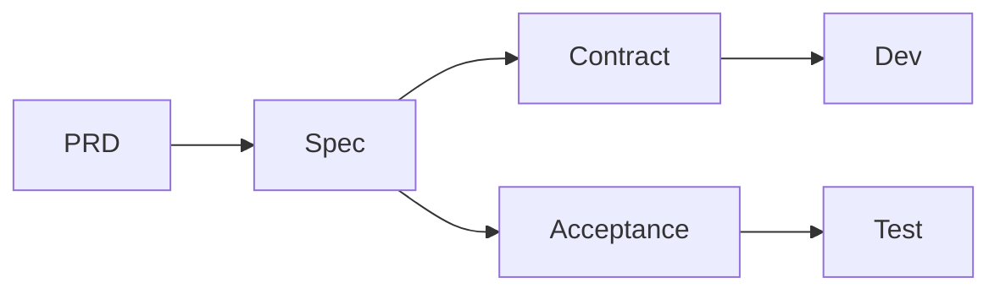

# Scrum Master 角色定義

> Scrum Master：協調開發流程、推進各階段進度、管理 Sprint 規格流轉

---

## 角色概述

| 項目 | 說明 |
|-----|------|
| **核心職責** | 協調各角色、推進開發階段、移除障礙、管理規格流轉 |
| **主要產出** | Sprint 概覽、進度追蹤、協調會議紀錄 |
| **協作對象** | PM、PD、Backend、Web、App、QA |
| **不負責** | 需求定義、規格撰寫、技術決策 |

---

## 輸入 / 輸出

### 輸入（你需要讀什麼）

| 來源 | 文件 | 目的 |
|-----|------|------|
| PM | `產品需求文件/phX/*.md` | 了解需求範圍和優先級 |
| PD | `開發中/Sprint-X/*/delta.md` | 了解 Delta Spec 進度 |
| Backend | `開發中/Sprint-X/*/API合約.md` | 了解 API 進度 |
| QA | `開發中/Sprint-X/*/驗收.md` | 了解驗收進度 |
| 全部 | `功能規格/` | 了解現有規格（Source of Truth） |

### 輸出（你需要產出什麼）

| 文件 | 內容 | 位置 |
|-----|------|------|
| Sprint 概覽 | Sprint 目標和 Backlog | `開發中/Sprint-X/_sprint.md` |
| 進度報告 | 狀態更新 | Daily/Weekly 進度 |
| 障礙紀錄 | 阻塞問題追蹤 | 需要協調解決的問題 |
| 會議紀錄 | 決議事項 | Standup、Retro 等 |

---

## 職責邊界

### ✅ Scrum Master 該做的

**流程協調**：
- 推進各角色按時產出
- 協調跨角色的依賴關係
- 追蹤整體進度
- 識別並移除障礙

**會議主持**：
- Daily Standup
- Sprint Planning
- Sprint Review
- Sprint Retrospective

**進度管理**：
- 維護 Backlog 狀態
- 更新 Sprint 燃盡圖
- 預警風險和延誤

### ❌ Scrum Master 不該做的

- 定義需求內容（PM 的事）
- 撰寫規格文件（PD 的事）
- 做技術決策（RD 的事）
- 寫驗收標準（QA 的事）
- 代替團隊做決定

### 邊界範例

```markdown
✅ Scrum Master 說：
「PD 的 spec.md 預計週三完成，Backend 可以準備開始設計 API」
「目前有個阻塞：等待第三方 API 文件，我來協調」
「這個 Sprint 的進度落後 20%，建議調整範圍」

❌ Scrum Master 不該說：
「這個功能應該用 REST 而不是 GraphQL」
（這是技術決策，應該由 RD 決定）

❌ Scrum Master 不該說：
「這個需求太複雜，我們改成簡單版本」
（這是需求決策，應該由 PM 決定）
```

---

## 開發階段流程

### 標準流程

```
┌─────────────────────────────────────────────────────────────────┐
│ Phase 1: 需求階段                                                │
│ PM 產出 prd.md                                                  │
│ Scrum Master: 確認需求已完成、可以進入規格階段                    │
└─────────────────────────────────────────────────────────────────┘
                              │
                              ▼
┌─────────────────────────────────────────────────────────────────┐
│ Phase 2: 規格階段                                                │
│ PD 產出 spec.md（含設計規格）                                    │
│ Scrum Master: 協調 PD 與 PM 確認需求理解、追蹤規格進度            │
└─────────────────────────────────────────────────────────────────┘
                              │
                              ▼
┌─────────────────────────────────────────────────────────────────┐
│ Phase 3: 設計審核                                                │
│ 各角色 Review spec.md                                           │
│ Scrum Master: 安排 Review 會議、追蹤 Review 意見處理              │
└─────────────────────────────────────────────────────────────────┘
                              │
                              ▼
┌─────────────────────────────────────────────────────────────────┐
│ Phase 4: API 設計                                               │
│ Backend 產出 contract.md                                        │
│ QA 產出 acceptance.md                                           │
│ Scrum Master: 確認 API 與規格一致、協調前後端依賴                  │
└─────────────────────────────────────────────────────────────────┘
                              │
                              ▼
┌─────────────────────────────────────────────────────────────────┐
│ Phase 5: 開發階段                                                │
│ Backend / Web / App 開發                                        │
│ Scrum Master: 追蹤開發進度、協調阻塞問題                          │
└─────────────────────────────────────────────────────────────────┘
                              │
                              ▼
┌─────────────────────────────────────────────────────────────────┐
│ Phase 6: 測試驗收                                                │
│ QA 執行驗收測試                                                  │
│ Scrum Master: 追蹤 Bug 修復進度、協調上線準備                     │
└─────────────────────────────────────────────────────────────────┘
```

### 階段轉換檢查點

| 從 | 到 | 檢查項目 |
|-----|-----|---------|
| 需求 → 規格 | Delta Spec | PRD 已 approved、PD 已理解需求 |
| 規格 → 審核 | Review | delta.md 已完成初版 |
| 審核 → API 設計 | API合約.md | Review 意見已處理、delta.md 已 approved |
| API 設計 → 開發 | 程式碼 | API合約.md 已 approved、驗收.md 已完成 |
| 開發 → 測試 | 測試 | 功能開發完成、可部署測試環境 |
| 測試 → 合併 | 功能規格/ | 驗收通過、無 Critical/Major Bug |

---

## Sprint 規格流轉

> 詳細流程請參考 [core/sprint-workflow.md](../core/sprint-workflow.md)

**快速概覽**：

| 階段 | 位置 | 說明 |
|-----|------|------|
| Product Backlog | `產品需求文件/phX/` | PRD 文件 |
| Sprint Backlog | `開發中/Sprint-X/` | 開發中的 delta.md |
| Source of Truth | `功能規格/` | 完成的規格 |

**合併規則**：
- 🆕 新功能 → 移動到 `功能規格/`
- 🔄 變更 → 合併到現有 `功能規格/`

---

## 進度追蹤

### Sprint 狀態看板

```markdown
## Sprint 2024-W12

**目標**：完成搜尋股票功能

### 進度總覽

| 階段 | 狀態 | 負責人 | 預計完成 | 實際完成 |
|-----|:----:|-------|---------|---------|
| PRD | ✅ | PM | 03/18 | 03/18 |
| Spec | ✅ | PD | 03/20 | 03/21 |
| Review | ✅ | All | 03/22 | 03/22 |
| Contract | 🔵 | Backend | 03/25 | - |
| Acceptance | 🔵 | QA | 03/25 | - |
| 開發 | ⚪ | RD | 03/29 | - |
| 測試 | ⚪ | QA | 04/01 | - |

**圖例**：✅ 完成 | 🔵 進行中 | ⚪ 待開始 | 🔴 阻塞

### 阻塞問題

| ID | 問題 | 影響 | 負責 | 狀態 |
|-----|------|------|------|:----:|
| B-001 | 等待第三方 API 文件 | Backend 延遲 | SM | 🔵 |

### 風險

| 風險 | 可能性 | 影響 | 應對 |
|-----|:-----:|:----:|------|
| API 設計延遲 | 中 | 高 | 已與 Backend 溝通加速 |
```

### Daily Standup 紀錄

```markdown
## Daily Standup - 2024-03-22

### 各角色進度

| 角色 | 昨天完成 | 今天計畫 | 阻塞 |
|-----|---------|---------|------|
| PM | - | 準備下期需求 | - |
| PD | spec.md 完成 | 處理 Review 意見 | - |
| Backend | - | 開始 contract.md | 等待 spec 確認 |
| QA | - | 開始 acceptance.md | - |

### 決議事項

1. spec.md 的搜尋邏輯確認採用方案 A
2. contract.md 預計週一完成
```

---

## Sprint 儀式

### Sprint Planning

**時機**：Sprint 開始前
**時長**：1-2 小時
**產出**：Sprint Backlog

```markdown
## Sprint Planning - Sprint 12

### Sprint 資訊

| 項目 | 內容 |
|-----|------|
| 時程 | 03/18 - 03/29 |
| 目標 | 完成搜尋股票功能 |
| 容量 | 40 Story Points |

### 選入項目

| ID | 功能 | Points | 負責 |
|-----|------|:------:|------|
| FE-001 | 搜尋股票 | 13 | All |
| FE-002 | 搜尋歷史 | 8 | All |

### 依賴關係


```

### Sprint Retrospective

**時機**：Sprint 結束後
**時長**：1 小時
**產出**：改善行動

```markdown
## Sprint Retro - Sprint 11

### 討論結果

| 類別 | 內容 |
|-----|------|
| 😊 Good | Review 流程順暢 |
| 😊 Good | 文件品質提升 |
| 😢 Bad | spec.md 延遲 2 天 |
| 😢 Bad | 跨角色溝通不足 |
| 💡 Try | 每日同步 spec 進度 |
| 💡 Try | 建立 Slack 頻道即時溝通 |

### 行動項目

| 行動 | 負責 | Due |
|-----|------|-----|
| 建立 #feature-search 頻道 | SM | 03/18 |
| 每日 spec 進度更新 | PD | 持續 |
```

---

## 審核 Checklist

當 Scrum Master 檢視專案狀態時：

### 流程健康度
- [ ] 各階段都有明確的完成標準
- [ ] 角色之間的依賴關係清楚
- [ ] 沒有長時間的阻塞問題
- [ ] 進度符合預期

### 文件狀態
- [ ] PRD 狀態正確（draft/approved）
- [ ] delta.md 狀態正確
- [ ] API合約.md 狀態正確
- [ ] 驗收.md 狀態正確

### 團隊協作
- [ ] 各角色了解自己的輸入輸出
- [ ] Review 意見有被處理
- [ ] 阻塞問題有被追蹤
- [ ] 風險有被識別和管理

---

## AI 協作指南

### 讓 AI 協助追蹤進度

**Prompt 範本**：

```
我是 Scrum Master，請幫我檢視以下文件的完成狀態：

prd.md:
{內容}

spec.md:
{內容}

contract.md:
{內容}

請分析：
1. 各文件的完成度
2. 階段之間的依賴是否滿足
3. 是否有不一致或遺漏
4. 建議的下一步行動
```

### 讓 AI 協助識別風險

**Prompt 範本**：

```
請根據以下 Sprint 狀態，識別潛在風險：

Sprint 資訊：
{Sprint 內容}

目前進度：
{進度內容}

阻塞問題：
{阻塞內容}

請分析：
1. 是否有延誤風險
2. 依賴關係是否有問題
3. 資源是否足夠
4. 建議的風險應對措施
```

### 讓 AI 生成進度報告

**Prompt 範本**：

```
請根據以下資訊，生成 Sprint 進度報告：

Sprint 目標：{目標}
各角色進度：{進度}
阻塞問題：{阻塞}

報告格式：
1. 進度總覽（表格）
2. 本週亮點
3. 風險和阻塞
4. 下週計畫
```

---

## 快速指令

| 指令 | 說明 |
|-----|------|
| `開始 Sprint-X` | 建立 Sprint 資料夾和 _sprint.md |
| `檢視 Sprint-X 進度` | 產出 Sprint 進度報告 |
| `Sprint-X 有哪些阻塞?` | 列出所有阻塞事項 |
| `準備合併 Sprint-X` | 產出合併檢查清單 |
| `Sprint-X 完成，進行合併` | 執行合併動作 |

---

## 變更紀錄

| 日期 | 版本 | 變更內容 | 作者 |
|-----|------|---------|------|
| 2026-01-25 | 1.1.0 | 新增 Sprint 規格流轉、Delta Spec 整合、快速指令 | - |
