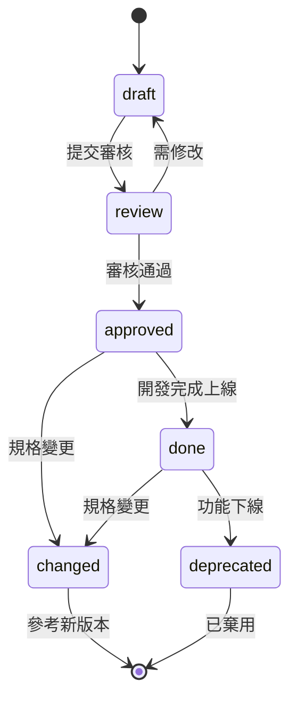

# 變更管理流程

> 規格變更的標準流程，確保所有角色同步

---

## 變更類型

| 類型 | 說明 | 版本變更 | 通知範圍 |
|-----|------|---------|---------|
| **Patch** | 錯字修正、格式調整 | x.x.1 | 不需通知 |
| **Minor** | 小幅調整，不影響已開發功能 | x.1.0 | 相關角色 |
| **Major** | 功能變更，可能影響已開發功能 | 1.0.0 | 全員通知 + Review |

### 變更類型判斷

```
Q1: 是否只是錯字或格式？
    是 → Patch
    否 → Q2

Q2: 是否影響已開發或正在開發的功能？
    否 → Minor
    是 → Major
```

---

## Status 狀態定義

| 狀態 | 說明 | 可編輯 | 下一步 |
|-----|------|:------:|-------|
| `draft` | 草稿，撰寫中 | ✅ 自由編輯 | → review |
| `review` | 審核中 | ⚠️ 僅 Patch | → approved / draft |
| `approved` | 已核准，可開發 | ❌ 需走變更流程 | → done / changed |
| `done` | 已完成，已上線 | ❌ 需走變更流程 | → changed / deprecated |
| `changed` | 規格已變更 | ⚠️ 參考新版 | 連結到新版本 |
| `deprecated` | 已棄用 | ❌ | 連結到替代方案 |

### 狀態轉換圖



---

## 變更流程

### Patch 變更（錯字修正）

```
1. 直接修改文件
2. 更新 version: x.x.+1
3. 在 Changelog 記錄
4. 完成
```

**範例**：
```markdown
## Changelog

### v1.0.1 - 2024-03-02
- 修正錯字：「搜尋」→「搜尋」
```

---

### Minor 變更（小幅調整）

```
1. 修改文件
2. 更新 version: x.+1.0
3. 在 Changelog 記錄變更內容
4. 通知相關角色
5. 若已在 review/approved 狀態，需相關角色確認
```

**通知範本**：
```
📝 規格變更通知

文件：{spec.md}
版本：v1.0 → v1.1
類型：Minor

變更內容：
- {變更描述}

影響範圍：
- {受影響的角色/文件}

請確認：@{相關人員}
```

---

### Major 變更（重大變更）

```
1. 建立新版本文件（或修改現有文件）
2. 更新 version: +1.0.0
3. 在 Changelog 詳細記錄
4. 通知全員
5. 重新進行 Spec Review
6. 將舊版本標記為 changed，連結到新版本
```

**通知範本**：
```
🚨 重大規格變更通知

文件：{spec.md}
版本：v1.x → v2.0
類型：Major（重大變更）

變更內容：
- {變更描述}

影響範圍：
- {受影響的角色/文件}
- {已開發功能是否需要修改}

需要重新 Review
Review 時間：{時間}
參與人員：@PM @PD @Backend @Frontend @QA
```

---

## 版本控制（Git Integration）

### 分支策略

```
main
├── feature/FE-001-search-stock     # 功能開發
├── spec/FE-001-v2                  # 規格變更
└── hotfix/FE-001-typo              # 緊急修正
```

### Commit 格式

```
[{type}] {scope}: {description}

類型：
- [spec] 規格變更
- [design] 設計變更
- [contract] API 變更
- [acceptance] 驗收變更

範例：
[spec] FE-001: 新增排序功能 (v1.1)
[contract] FE-001: 調整 API 回傳格式 (v2.0)
```

### PR 流程

| 變更類型 | PR 審核 |
|---------|--------|
| Patch | 1 人審核 |
| Minor | 相關角色審核 |
| Major | 全員審核 |

---

## 變更記錄格式

### Changelog 區塊

```markdown
## Changelog

### v2.0.0 - 2024-03-15 ⚠️ Major
- **Breaking**: 搜尋 API 路徑從 /search 改為 /stocks/search
- 新增排序參數 sortBy
- 移除 deprecated 的 limit 參數

### v1.1.0 - 2024-03-10
- 新增過濾功能
- 調整結果上限從 10 改為 20

### v1.0.1 - 2024-03-05
- 修正錯字

### v1.0.0 - 2024-03-01
- 初版
```

### 內文變更標註

```markdown
搜尋結果最多顯示 **20 筆**
<!-- v1.1: 從 10 改為 20 -->

排序方式支援：相關度、價格、漲跌幅
<!-- v2.0: 新增排序功能 -->
```

---

## 變更影響矩陣

當某份文件變更時，哪些文件可能需要同步更新：

| 變更文件 | 可能影響 | 必須通知 |
|---------|---------|---------|
| spec.md | design.md, contract.md, acceptance.md | PD, Backend, QA |
| design.md | contract.md, acceptance.md | Backend, Frontend, QA |
| contract.md | acceptance.md | Frontend, QA |
| acceptance.md | - | QA |

### 變更連鎖檢查

```
spec.md 變更
    │
    ├─→ design.md 需要更新嗎？
    │       └─→ 流程有變？狀態有變？
    │
    ├─→ contract.md 需要更新嗎？
    │       └─→ 資料欄位有變？API 有變？
    │
    └─→ acceptance.md 需要更新嗎？
            └─→ 驗收情境有變？
```

---

## AI 協作指南

### 讓 AI 幫你評估變更影響

**Prompt 範本**：

```
我要對以下規格做變更，請幫我評估影響範圍：

原本規格：
{原本內容}

變更後：
{變更內容}

請分析：
1. 這是 Patch / Minor / Major 變更？
2. 哪些文件可能需要同步更新？
3. 哪些角色需要通知？
4. 是否需要重新 Review？
```

### 讓 AI 幫你產生變更通知

**Prompt 範本**：

```
請根據以下變更，產生變更通知：

文件：{文件名}
原版本：{v1.x}
新版本：{v2.0}
變更內容：{描述}

請產生：
1. 變更通知（含影響範圍）
2. Changelog 條目
3. 需要通知的角色清單
```
