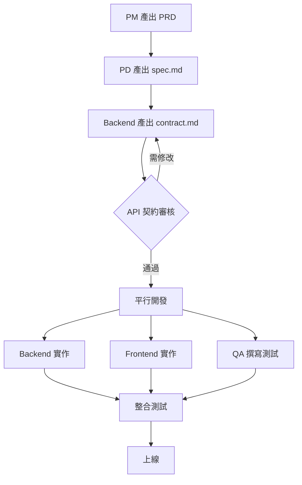
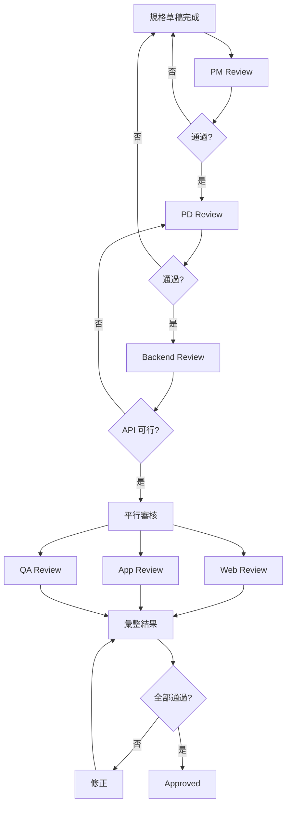
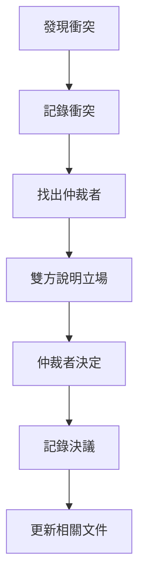

# 多角色審核流程

> 確保規格品質的協作審核機制

---

## 開發流程總覽



### 流程說明

| 階段 | 負責人 | 產出 | 說明 |
|-----|-------|------|------|
| 1. 需求定義 | PM | `prd.md` | 定義為什麼做、做什麼 |
| 2. 規格設計 | PD | `spec.md` | 轉換需求為可執行規格 |
| 3. API 契約 | Backend | `contract.md` | 定義前後端資料協議 |
| 4. 契約審核 | PD + Frontend | - | 確認 API 滿足前端需求 |
| 5. 平行開發 | Backend / Frontend / QA | 程式碼 / 測試案例 | API 確認後同時動工 |

> 💡 **關鍵**：API 契約（contract.md）確認後，Backend、Frontend、QA 可以同時開始工作，不需要等待彼此。

---

## 規格審核流程



---

## 各角色審核職責

### PM Review

**審核重點**：需求正確性

| 檢查項目 | 說明 |
|---------|------|
| 需求完整 | 所有需求都有被涵蓋 |
| 優先級正確 | 功能範圍符合 scope |
| 價值明確 | 使用者價值有被體現 |

**產出**：
- ✅ 需求正確
- ⚠️ 需求遺漏：{列出}
- ❌ 需求錯誤：{列出}

### PD Review

**審核重點**：規格一致性 + 設計完整性

| 檢查項目 | 說明 |
|---------|------|
| 流程一致 | spec/design/contract 流程對齊 |
| 資料一致 | 欄位名稱和型別一致 |
| 狀態一致 | 所有狀態都有定義 |
| 流程完整 | 所有路徑都有設計 |
| 狀態完整 | 所有狀態都有 UI |
| 規格清晰 | 元件規格無歧義 |

**產出**：
- ✅ 規格一致、設計完整
- ⚠️ 不一致處：{列出}
- ⚠️ 缺少設計：{列出}

### Backend Review

**審核重點**：API 可行性

| 檢查項目 | 說明 |
|---------|------|
| 資料可取得 | 所有欄位都有資料來源 |
| 效能可達成 | 回應時間目標可行 |
| 安全性 | 權限和驗證明確 |

**產出**：
- ✅ API 可行
- ⚠️ 技術風險：{列出}
- ❌ 無法實作：{列出原因}

### Web Developer Review

**審核重點**：Web 實作可行性

| 檢查項目 | 說明 |
|---------|------|
| 設計可實作 | UI 效果可在 Web 達成 |
| API 足夠 | 所有資料都有 API 提供 |
| 互動明確 | 互動行為定義清楚 |
| RWD 明確 | 斷點和佈局定義清楚 |

**產出**：
- ✅ Web 可實作
- ⚠️ 需要釐清：{列出}

### App Developer Review

**審核重點**：App 實作可行性

| 檢查項目 | 說明 |
|---------|------|
| 設計可實作 | UI 效果可在 iOS/Android 達成 |
| API 足夠 | 所有資料都有 API 提供 |
| 平台差異 | iOS/Android 差異有定義 |
| 離線處理 | 離線情境有規劃 |

**產出**：
- ✅ App 可實作
- ⚠️ 需要釐清：{列出}
- ⚠️ 平台差異建議：{列出}

### QA Review

**審核重點**：驗收可測性

| 檢查項目 | 說明 |
|---------|------|
| 情境完整 | 涵蓋正常/邊界/錯誤情境 |
| 可測試 | 每個情境都能實際測試 |
| 標準明確 | 預期結果無歧義 |

**產出**：
- ✅ 可測試
- ⚠️ 缺少情境：{列出}
- ❌ 無法測試：{列出原因}

---

## 審核紀錄格式

```markdown
## Review Record

### Round 1 - {date}

| 角色 | 結果 | 備註 |
|-----|:----:|------|
| PM | ✅ | |
| PD | ⚠️ | 流程圖需更新 |
| Backend | ✅ | |
| Frontend | ⚠️ | 需確認 Loading 動畫規格 |
| QA | ✅ | |

**待修正**：
1. 更新流程圖（PD）
2. 補充 Loading 動畫規格（PD）

### Round 2 - {date}

| 角色 | 結果 | 備註 |
|-----|:----:|------|
| PD | ✅ | 流程圖已更新 |
| Frontend | ✅ | Loading 規格已明確 |

**結果**：Approved ✅
```

---

## 審核時程建議

| Level | 建議審核時間 | 說明 |
|:-----:|:-----------:|------|
| 0 | 不需審核 | 單人快速開發 |
| 1 | 1 小時 | PM + RD 快速對齊 |
| 2 | 半天 | 完整角色審核 |
| 3 | 1-2 天 | 含跨團隊協調 |

---

## 審核工具整合

### 使用 AI 輔助審核

```
請依序扮演以下角色審核這份規格：

1. PM：檢查需求正確性
2. PD：檢查規格一致性、設計完整性
3. Backend：檢查 API 可行性
4. Web Developer：檢查 Web 實作可行性
5. App Developer：檢查 App 實作可行性
6. QA：檢查驗收可測性

每個角色產出：
- ✅ 通過項目
- ⚠️ 建議修改
- ❌ 必須修改
- ❓ 需要澄清
```

### 整合 Git 流程

```
feature/FE-001-search-stock
├── spec.md (status: review)
├── design.md
├── contract.md
└── acceptance.md

PR Review = Spec Review
Merge = Approved
```

---

## 衝突解決機制

當審核過程中發現文件之間有矛盾，或角色之間有不同意見時，使用以下機制解決。

### 衝突類型與仲裁者

| 衝突類型 | 仲裁者 | 原則 |
|---------|-------|------|
| 需求 vs 設計 | **PM** | 需求優先，設計配合需求 |
| 設計 vs API | **PD** | 體驗優先，技術可行性次之 |
| API vs 前端實作 | **Backend** | 技術可行性，但需考慮前端成本 |
| 規格 vs 驗收 | **PD** | 規格為準，驗收配合規格 |
| 效能 vs 體驗 | **PM** | 根據業務優先級決定 |

### 衝突解決流程



### 衝突記錄格式

在審核紀錄中新增衝突區塊：

```markdown
## Conflicts

### Conflict #1 - {date}

| 項目 | 內容 |
|-----|------|
| 衝突文件 | design.md vs contract.md |
| 衝突描述 | 設計要求即時更新股價，API 只能每 5 秒更新一次 |
| 角色 A | PD：希望即時更新，提升體驗 |
| 角色 B | Backend：即時更新會造成伺服器負擔 |
| 仲裁者 | PM |
| 決議 | 採用 5 秒更新，但前端顯示「約 5 秒前更新」提示 |
| 後續 | design.md 新增更新時間提示，contract.md 維持原設計 |
```

### 衝突升級機制

當仲裁者無法決定時：

```
Level 1: 指定仲裁者決定
    ↓ 無法決定
Level 2: PM + PD 共同討論
    ↓ 無法決定
Level 3: 產品負責人 / 技術負責人介入
    ↓ 無法決定
Level 4: 暫停該功能，重新評估需求
```

### 常見衝突情境與建議

| 情境 | 建議決議 |
|-----|---------|
| API 無法提供設計需要的欄位 | 評估：是否真的需要？可否從其他來源取得？ |
| 效能目標無法達成 | 降低目標或調整設計（如分頁、懶加載） |
| 前端無法實現設計效果 | 簡化設計或分階段實作 |
| 驗收情境無法測試 | 調整規格使其可測，或改為手動驗收 |

---

## AI 協作指南

### 讓 AI 幫你發現衝突

**Prompt 範本**：

```
請檢查以下文件是否有衝突或不一致：

spec.md:
{內容}

design.md:
{內容}

contract.md:
{內容}

請列出：
1. 所有不一致的地方
2. 建議的解決方式
3. 需要哪個角色決定
```

### 讓 AI 幫你記錄衝突決議

**Prompt 範本**：

```
請幫我記錄以下衝突決議：

衝突：{描述}
角色 A 立場：{立場}
角色 B 立場：{立場}
最終決議：{決議}

請產出：
1. 衝突記錄（Markdown 格式）
2. 需要更新的文件清單
3. 更新建議
```
