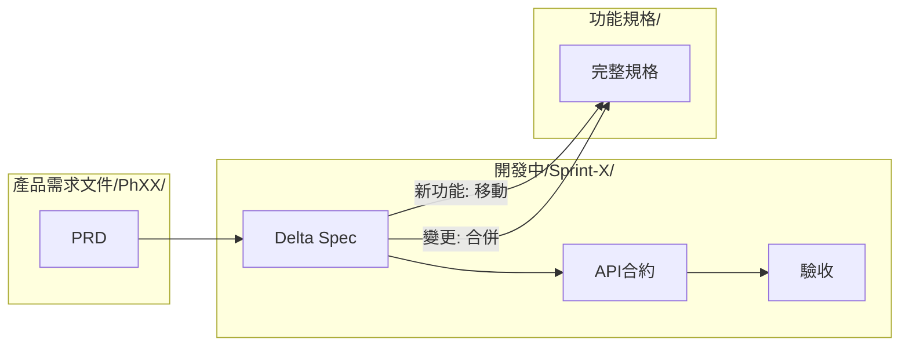
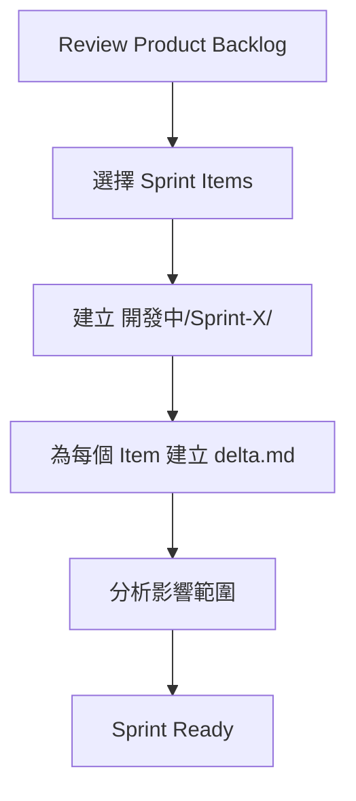
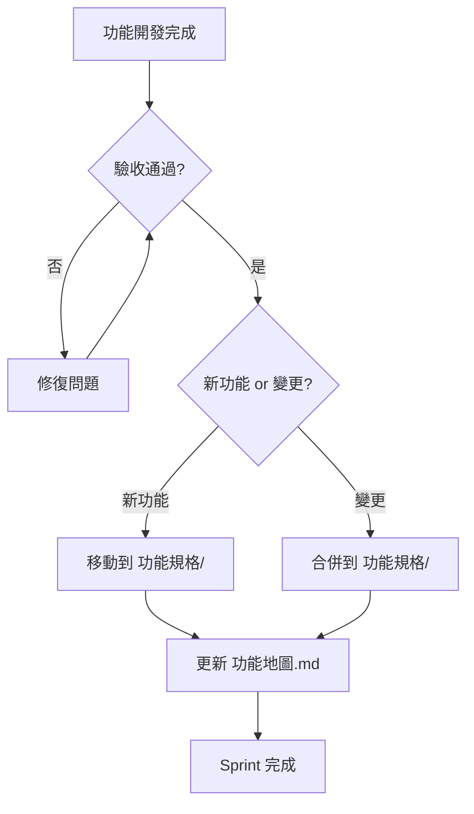

# Sprint 開發流程

> Scrum 迭代開發的規格管理流程

---

## 流程總覽



---

## 資料夾結構

```
專案根目錄/
├── 產品需求文件/           # Product Backlog
│   ├── ph0/               # Phase 0 需求
│   │   ├── _overview.md   # Phase 概覽
│   │   ├── 功能A.md
│   │   └── 功能B.md
│   └── ph1/
│       └── ...
│
├── 開發中/                 # Sprint Backlog (WIP)
│   ├── Sprint-1/
│   │   ├── _sprint.md     # Sprint 概覽
│   │   ├── 功能A/         # 新功能
│   │   │   ├── delta.md   # Delta Spec
│   │   │   ├── API合約.md
│   │   │   └── 驗收.md
│   │   └── 功能B/         # 變更功能
│   │       └── delta.md   # Delta Spec (差異)
│   └── Sprint-2/
│       └── ...
│
├── 功能規格/               # Done (Source of Truth)
│   ├── 功能地圖.md
│   ├── 功能A/
│   │   ├── 規格.md        # 完整規格
│   │   ├── API合約.md
│   │   ├── 驗收.md
│   │   └── mockup/
│   └── 功能B/
│       └── ...
│
└── 知識庫/                 # Reference
    └── ...
```

---

## Sprint 生命週期

### 1. Sprint Planning



**輸入**：
- `產品需求文件/phX/*.md` - PRD 文件
- `功能規格/` - 現有規格 (Source of Truth)

**產出**：
- `開發中/Sprint-X/_sprint.md` - Sprint 概覽
- `開發中/Sprint-X/{功能}/delta.md` - Delta Spec

### 2. Sprint 開發

| 階段 | 負責人 | 產出位置 |
|-----|-------|---------|
| Delta Spec | PD | `開發中/Sprint-X/{功能}/delta.md` |
| API 契約 | Backend | `開發中/Sprint-X/{功能}/API合約.md` |
| 驗收標準 | QA | `開發中/Sprint-X/{功能}/驗收.md` |

### 3. Sprint Review



### 4. Sprint 結束

**新功能**：
```bash
# 移動整個資料夾
mv 開發中/Sprint-X/新功能/ 功能規格/新功能/
```

**變更功能**：
```bash
# 合併 Delta 到現有規格
# 1. 更新 規格.md（套用變更）
# 2. 更新 API合約.md
# 3. 更新 驗收.md
# 4. 更新版本號
```

---

## Delta Spec 核心概念

### 為什麼需要 Delta Spec?

| 問題 | Delta Spec 解決方案 |
|------|-------------------|
| 難以看出「這次要改什麼」 | 明確標記 [NEW] / [MODIFIED] / [REMOVED] |
| 不知道會影響哪些現有規格 | Impact Analysis 區塊 |
| 跨文件連動更新困難 | 明確連結到 Source of Truth |
| 各角色不知道自己該改什麼 | 按角色列出影響範圍 |

### 變更標記

| 標記 | 說明 | 使用時機 |
|:---:|------|---------|
| `[NEW]` | 新增項目 | 全新的流程、頁面、API |
| `[MODIFIED]` | 修改項目 | 變更現有行為 |
| `[REMOVED]` | 移除項目 | 刪除功能或流程 |

### 影響範圍分析

每個 Delta Spec 必須包含影響範圍分析：

```markdown
## 影響範圍 (Impact Analysis)

### 對現有規格的影響

| 文件 | 區塊 | 變更類型 | 說明 |
|------|------|:--------:|------|
| [規格.md](../../功能規格/用戶引導/規格.md) | 使用者流程 | [MODIFIED] | 新增分支條件 |
| [API合約.md](../../功能規格/用戶引導/API合約.md) | POST /answers | [MODIFIED] | 新增 request 欄位 |
| [驗收.md](../../功能規格/用戶引導/驗收.md) | TC-FL-003 | [MODIFIED] | 調整預期結果 |

### 各角色待辦

| 角色 | 待辦事項 | 優先級 |
|------|---------|:------:|
| PD | 更新流程圖 | P0 |
| Backend | 修改 POST /answers API | P0 |
| Frontend | 調整問卷送出邏輯 | P0 |
| QA | 更新 TC-FL-003 測試案例 | P1 |
```

---

## Sprint 儀式整合

### Sprint Planning 會議

**輸入文件**：
1. `產品需求文件/phX/_overview.md` - Phase 目標
2. `產品需求文件/phX/*.md` - PRD 清單
3. `功能規格/功能地圖.md` - 現有功能

**會議產出**：
1. `開發中/Sprint-X/_sprint.md` - Sprint 概覽
2. 選定的 PRD Items

### Daily Standup

**參考文件**：
- `開發中/Sprint-X/_sprint.md` - Sprint 進度
- 各功能的 `delta.md` - 待確認事項

### Sprint Review

**展示內容**：
- 完成的 Delta Spec
- 通過驗收的功能

**會議產出**：
- 更新 Sprint Status
- 確認可合併到 `功能規格/` 的項目

### Sprint Retrospective

**紀錄位置**：
- `開發中/Sprint-X/_retro.md`

---

## 合併檢查清單

Sprint 結束時，將 `開發中/` 合併到 `功能規格/` 前的檢查：

### 文件完整性

- [ ] delta.md 所有 `[NEW]` 項目都有完整規格
- [ ] delta.md 所有 `[MODIFIED]` 項目都有 before/after
- [ ] API合約.md 已完成
- [ ] 驗收.md 已完成

### 品質檢查

- [ ] 所有待確認事項已解決（無 🔵 狀態）
- [ ] 所有驗收案例通過（無 ⬜ 狀態）
- [ ] 無 Critical / Major Bug

### 合併動作

- [ ] 更新 `功能規格/{功能}/規格.md` 版本號
- [ ] 更新 Changelog
- [ ] 更新 `功能規格/功能地圖.md`
- [ ] 封存 `開發中/Sprint-X/{功能}/`

---

## 版本管理

### 規格版本格式

```
{Major}.{Minor}.{Patch}
```

| 類型 | 說明 | 範例 |
|------|------|------|
| Major | 重大變更，不向下相容 | 1.0.0 → 2.0.0 |
| Minor | 新增功能，向下相容 | 1.0.0 → 1.1.0 |
| Patch | Bug 修復或小調整 | 1.0.0 → 1.0.1 |

### Changelog 格式

```markdown
## Changelog

| 版本 | 日期 | Sprint | 變更內容 | 作者 |
|-----|------|--------|---------|------|
| 1.2.0 | 2024-01-25 | Sprint-5 | 新增問卷分支邏輯 | @pd |
| 1.1.0 | 2024-01-10 | Sprint-3 | 新增 Q8-Q9 問題 | @pd |
| 1.0.0 | 2023-12-15 | Sprint-1 | 初版 | @pd |
```

---

## AI 協作指南

### 讓 AI 幫你產出 Delta Spec

**Prompt 範本**：

```
我要在 Sprint-X 修改「{功能名稱}」功能。

現有規格：
{功能規格/{功能}/規格.md 內容}

本次需求變更：
{描述變更內容}

請產出 delta.md，包含：
1. Metadata（Sprint, Version）
2. 變更摘要
3. 詳細變更（使用 [NEW]/[MODIFIED]/[REMOVED] 標記）
4. 影響範圍分析（對現有 規格.md、API合約.md、驗收.md 的影響）
5. 各角色待辦事項
```

### 讓 AI 幫你合併 Delta

**Prompt 範本**：

```
請幫我將 Delta Spec 合併到現有規格：

現有規格：
{規格.md 內容}

Delta Spec：
{delta.md 內容}

請：
1. 產出合併後的完整 規格.md
2. 更新版本號
3. 更新 Changelog
4. 列出需要人工確認的項目
```

---

## 參考文件

- `templates/delta.md` - Delta Spec 模板（中文）
- `templates/en/delta.md` - Delta Spec 模板（英文）
- `templates/sprint/_sprint.md` - Sprint 概覽模板
- `agents/scrum-master.md` - Scrum Master 角色定義
- `core/review-workflow.md` - 多角色審核流程
