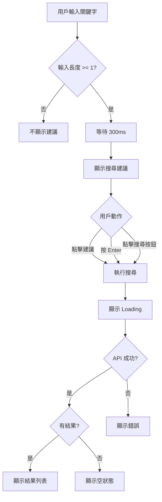

# Spec: 商品搜尋

> 功能規格文件（含設計規格）

---

## Metadata

| 項目 | 內容 |
|-----|------|
| 功能 ID | FE-001 |
| 功能名稱 | 商品搜尋 |
| PRD | [prd.md](./prd.md) |
| 負責 PD | @pd-sarah |
| 建立日期 | 2024-01-20 |
| 狀態 | Approved |

---

## 1. 功能概述

### 1.1 功能說明

用戶可以透過搜尋框輸入關鍵字搜尋商品，系統會即時顯示搜尋建議，並在送出後顯示搜尋結果。用戶可以對結果進行篩選和排序。

### 1.2 相關業務規則

- [商品上架規則](../../knowledge/business/rules/product-listing.md)
- [價格顯示規則](../../knowledge/business/rules/pricing.md)

---

## 2. 功能規格

### 2.1 功能清單

| # | 功能 | 描述 | 優先級 |
|:-:|-----|------|:------:|
| 1 | 關鍵字搜尋 | 輸入關鍵字搜尋商品 | P0 |
| 2 | 搜尋建議 | 輸入時顯示搜尋建議 | P0 |
| 3 | 搜尋結果 | 顯示搜尋結果列表 | P0 |
| 4 | 結果篩選 | 篩選搜尋結果 | P1 |
| 5 | 結果排序 | 排序搜尋結果 | P1 |

### 2.2 功能詳細規格

#### 功能 1: 關鍵字搜尋

**觸發條件**：
- 用戶在搜尋框輸入關鍵字並按下 Enter 或點擊搜尋按鈕

**處理邏輯**：
```
1. 驗證輸入（1-50 字元）
2. 轉換繁簡體
3. 呼叫搜尋 API
4. 顯示搜尋結果
```

**輸出結果**：
- 成功：顯示搜尋結果頁
- 失敗：顯示錯誤訊息

**業務規則**：
- 空白輸入不觸發搜尋
- 自動去除前後空白
- 支援繁簡體中文

#### 功能 2: 搜尋建議

**觸發條件**：
- 用戶在搜尋框輸入文字
- 輸入後 300ms 無新輸入

**處理邏輯**：
```
1. 檢查輸入長度 >= 1
2. Debounce 300ms
3. 呼叫建議 API
4. 顯示建議列表
```

**輸出結果**：
- 有建議：顯示最多 10 筆建議
- 無建議：不顯示下拉選單

**業務規則**：
- 點擊建議項目直接搜尋
- 鍵盤上下可選擇建議

#### 功能 3: 搜尋結果

**觸發條件**：
- 搜尋完成

**處理邏輯**：
```
1. 接收 API 回傳
2. 渲染商品卡片
3. 顯示分頁資訊
```

**輸出結果**：
- 有結果：顯示商品列表（每頁 20 筆）
- 無結果：顯示「找不到符合的商品」

#### 功能 4: 結果篩選

**篩選項目**：

| 篩選 | 類型 | 選項 |
|-----|------|------|
| 價格範圍 | Range | 最低價 ~ 最高價 |
| 分類 | Multi-select | 動態從 API 取得 |
| 評價 | Single-select | 4星以上、3星以上 |

**處理邏輯**：
- 選擇篩選後即時更新結果
- 多個篩選條件為 AND 關係

#### 功能 5: 結果排序

**排序選項**：

| 選項 | 說明 | 預設 |
|-----|------|:----:|
| 相關度 | 搜尋相關度 | ✅ |
| 價格低到高 | 價格升冪 | |
| 價格高到低 | 價格降冪 | |
| 銷量 | 銷量降冪 | |
| 最新 | 上架時間降冪 | |

---

## 3. 設計規格

### 3.1 頁面結構

```
┌─────────────────────────────────────┐
│ Header（含搜尋框）                   │
├─────────────────────────────────────┤
│ 篩選列                              │
├─────────────────────────────────────┤
│                                     │
│           搜尋結果列表               │
│                                     │
├─────────────────────────────────────┤
│ Tab Bar                             │
└─────────────────────────────────────┘
```

### 3.2 頁面清單

| 頁面 | 路徑 | 說明 |
|-----|------|------|
| 搜尋結果頁 | `/search?q={keyword}` | 顯示搜尋結果 |

---

## 4. 介面描述

### 4.1 搜尋框（所有頁面 Header）

#### 畫面結構

```
┌─────────────────────────────────────┐
│ [Logo]  ┌─────────────────────┐ 🔍  │
│         │ 搜尋商品...          │     │
│         └─────────────────────┘     │
└─────────────────────────────────────┘
```

#### 搜尋建議展開

```
┌─────────────────────────────────────┐
│ [Logo]  ┌─────────────────────┐ 🔍  │
│         │ iPhone              │     │
│         ├─────────────────────┤     │
│         │ 🔍 iPhone 15        │     │
│         │ 🔍 iPhone 15 Pro    │     │
│         │ 🔍 iPhone 手機殼    │     │
│         │ 🔍 iPhone 充電器    │     │
│         └─────────────────────┘     │
└─────────────────────────────────────┘
```

#### 元件說明

| 元件 | 說明 | 互動 |
|-----|------|------|
| 搜尋框 | 輸入搜尋關鍵字 | Focus 時展開，輸入觸發建議 |
| 搜尋按鈕 | 放大鏡圖示 | 點擊執行搜尋 |
| 建議列表 | 搜尋建議下拉選單 | 點擊選項執行搜尋 |

---

### 4.2 搜尋結果頁

#### 畫面結構

```
┌─────────────────────────────────────┐
│ ← 返回     「iPhone」的搜尋結果      │
├─────────────────────────────────────┤
│ [分類 ▼] [價格 ▼] [評價 ▼]  排序 ▼  │
├─────────────────────────────────────┤
│ 找到 128 件商品                      │
├─────────────────────────────────────┤
│ ┌─────────┐ ┌─────────┐            │
│ │  圖片   │ │  圖片   │            │
│ ├─────────┤ ├─────────┤            │
│ │商品名稱 │ │商品名稱 │            │
│ │$1,299   │ │$999     │            │
│ │⭐ 4.5   │ │⭐ 4.8   │            │
│ └─────────┘ └─────────┘            │
│ ┌─────────┐ ┌─────────┐            │
│ │  圖片   │ │  圖片   │            │
│ │   ...   │ │   ...   │            │
│ └─────────┘ └─────────┘            │
├─────────────────────────────────────┤
│    [首頁]  [分類]  [購物車] [我的]   │
└─────────────────────────────────────┘
```

#### 元件說明

| 元件 | 說明 | 互動 |
|-----|------|------|
| 返回按鈕 | 左上角 ← | 返回上一頁 |
| 篩選按鈕 | 分類/價格/評價 | 點擊展開篩選選項 |
| 排序按鈕 | 右側排序 | 點擊展開排序選項 |
| 商品卡片 | 2 欄格狀排列 | 點擊進入商品詳情 |
| 結果數量 | 顯示總筆數 | 純顯示 |

#### 篩選展開

```
┌─────────────────────────────────────┐
│ ← 返回     「iPhone」的搜尋結果      │
├─────────────────────────────────────┤
│ [分類 ▼] [價格 ▼] [評價 ▼]  排序 ▼  │
├─────────────────────────────────────┤
│ ┌─────────────────────────────────┐ │
│ │ 價格範圍                        │ │
│ │ ┌─────────┐    ┌─────────┐     │ │
│ │ │ 最低價  │ ～ │ 最高價  │     │ │
│ │ └─────────┘    └─────────┘     │ │
│ │                                 │ │
│ │ [重置]              [套用篩選] │ │
│ └─────────────────────────────────┘ │
├─────────────────────────────────────┤
│ (背景模糊的搜尋結果)                 │
└─────────────────────────────────────┘
```

#### 狀態設計

**Loading 狀態**：
```
┌─────────────────────────────────────┐
│ ← 返回     搜尋結果                  │
├─────────────────────────────────────┤
│ ┌─────────┐ ┌─────────┐            │
│ │ ▓▓▓▓▓▓▓ │ │ ▓▓▓▓▓▓▓ │ ← Skeleton │
│ ├─────────┤ ├─────────┤            │
│ │ ▓▓▓▓▓   │ │ ▓▓▓▓▓   │            │
│ │ ▓▓▓     │ │ ▓▓▓     │            │
│ └─────────┘ └─────────┘            │
└─────────────────────────────────────┘
```

**Empty 狀態**：
```
┌─────────────────────────────────────┐
│ ← 返回     「xxxxx」的搜尋結果       │
├─────────────────────────────────────┤
│                                     │
│         🔍                          │
│         找不到「xxxxx」相關商品      │
│                                     │
│         試試其他關鍵字               │
│         或 [瀏覽熱門商品]            │
│                                     │
└─────────────────────────────────────┘
```

**Error 狀態**：
```
┌─────────────────────────────────────┐
│ ← 返回     搜尋結果                  │
├─────────────────────────────────────┤
│                                     │
│         ⚠️                          │
│         搜尋時發生錯誤               │
│                                     │
│         [重試]                      │
│                                     │
└─────────────────────────────────────┘
```

---

## 5. 互動規格

### 5.1 互動流程



### 5.2 互動細節

| 互動 | 觸發 | 行為 | 動畫 |
|-----|------|------|------|
| 顯示建議 | 輸入文字 | 下拉顯示建議 | 200ms fade-in |
| 隱藏建議 | 點擊外部 | 收起建議 | 150ms fade-out |
| 篩選展開 | 點擊篩選按鈕 | 展開篩選面板 | 300ms slide-down |
| 下拉更新 | 下拉列表 | 重新搜尋 | 標準下拉動畫 |
| 載入更多 | 滾動到底部 | 載入下一頁 | Loading indicator |

---

## 6. 元件規格

### 6.1 元件清單

| 元件 | Component Name | 說明 |
|-----|---------------|------|
| 搜尋框 | `SearchInput` | 搜尋輸入元件 |
| 搜尋建議 | `SearchSuggestion` | 搜尋建議下拉 |
| 篩選按鈕 | `FilterButton` | 篩選觸發按鈕 |
| 篩選面板 | `FilterPanel` | 篩選選項面板 |
| 商品卡片 | `ProductCard` | 商品展示卡片 |
| 空狀態 | `EmptyState` | 無結果顯示 |

### 6.2 元件詳細規格

#### SearchInput 搜尋框

**屬性**：
| 屬性 | 類型 | 說明 |
|-----|------|------|
| value | string | 輸入值 |
| placeholder | string | 提示文字 |
| onSearch | function | 搜尋回調 |
| onInput | function | 輸入回調（用於建議） |

**狀態**：
- Default：顯示 placeholder
- Focus：顯示游標、鍵盤彈出
- Filled：顯示輸入內容 + 清除按鈕

#### ProductCard 商品卡片

**屬性**：
| 屬性 | 類型 | 說明 |
|-----|------|------|
| product | Product | 商品資料 |
| onClick | function | 點擊回調 |

**顯示欄位**：
- 商品圖片（1:1 比例）
- 商品名稱（最多 2 行）
- 價格（紅色粗體）
- 評價星數

---

## 7. 資料對應

### 7.1 畫面與 API 對應

| 畫面欄位 | API 欄位 | 說明 |
|---------|---------|------|
| 商品圖片 | `product.imageUrl` | |
| 商品名稱 | `product.name` | 超過 2 行截斷 |
| 價格 | `product.price` | 格式化為 $1,299 |
| 評價 | `product.rating` | 顯示為星星 |
| 結果數量 | `pagination.total` | |

---

## 8. 非功能需求

### 8.1 效能需求

| 項目 | 需求 |
|-----|------|
| 搜尋回應 | < 500ms |
| 建議回應 | < 200ms |
| 首次渲染 | < 1s |
| 動畫流暢 | 60fps |

### 8.2 相容性

| 平台 | 版本 |
|-----|------|
| iOS | 15.0+ |
| Android | API 26+ |
| Web | Chrome/Safari/Firefox 最新 2 版 |

---

## 9. Out of Scope

| 項目 | 原因 | 未來計畫 |
|-----|------|---------|
| 語音搜尋 | 技術複雜度高 | Phase 2 |
| 圖片搜尋 | 需要 AI 模型 | Phase 3 |
| 搜尋歷史 | 先驗證核心功能 | Phase 2 |

---

## 10. 附件

### 10.1 視覺稿

- [Figma 連結](https://figma.com/example)

### 10.2 相關文件

- [PRD](./prd.md)
- [API 契約](./contract.md)
- [驗收標準](./acceptance.md)

---

## 變更紀錄

| 日期 | 版本 | 變更內容 | 作者 |
|-----|------|---------|------|
| 2024-01-20 | 1.0 | 初版 | @pd-sarah |
| 2024-01-22 | 1.1 | 新增篩選面板設計 | @pd-sarah |
