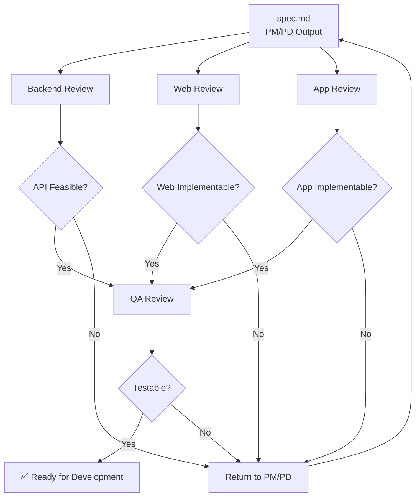

# Multi-Role Specification Review

This skill conducts comprehensive reviews from multiple role perspectives to ensure specification quality, feasibility, and consistency.

## Review Process



```
spec.md (PM/PD output)
    ↓
Backend Review → Confirm API feasibility
Web Review     → Confirm Web implementation feasibility
App Review     → Confirm App implementation feasibility
    ↓
QA Review      → Confirm testability
```

## How to Use

When user provides a spec document, review it from each role's perspective sequentially.

## Review Output Format

For each role, output:

```markdown
## {Role} Review

### ✅ Passed Items
- Item 1
- Item 2

### ⚠️ Suggestions
- Suggestion 1: [Description] → [Recommendation]

### ❌ Must Fix
- Issue 1: [Description] → [Required Action]

### ❓ Need Clarification
- Question 1: [What needs to be clarified]
```

## Role-Specific Review Focus

### PM Review Focus

- [ ] Requirements clearly described, no ambiguity
- [ ] User stories follow proper format
- [ ] Scope clearly defined (In/Out of Scope)
- [ ] Business value explicit
- [ ] Success metrics measurable

### Backend Review Focus

- [ ] API design is implementable
- [ ] Performance requirements are reasonable
- [ ] Data structure is logical
- [ ] Proper permission checks
- [ ] No sensitive data leak risks
- [ ] Rate limiting considered

### Web Review Focus

- [ ] UI design is web-implementable
- [ ] Animation effects are achievable
- [ ] Performance requirements reasonable
- [ ] API returns sufficient fields for display
- [ ] Pagination design fits UI needs
- [ ] Error codes cover all scenarios
- [ ] RWD breakpoints clearly defined
- [ ] Browser compatibility explicit
- [ ] SEO requirements clear

### App Review Focus

- [ ] UI design is iOS/Android implementable
- [ ] Animation effects achievable
- [ ] Performance requirements reasonable
- [ ] API returns sufficient fields
- [ ] Platform version requirements clear
- [ ] Platform differences defined
- [ ] Permission requirements clear
- [ ] Offline handling planned

### QA Review Focus

- [ ] Every requirement has acceptance criteria
- [ ] Acceptance steps are executable and verifiable
- [ ] Expected results are specific and quantifiable
- [ ] All normal flows covered
- [ ] All UI states covered
- [ ] All error codes covered
- [ ] Non-functional requirements testable

## Consistency Checks

After individual role reviews, check cross-document consistency:

### spec.md ↔ contract.md
- [ ] User flows are consistent
- [ ] Data fields match between UI and API
- [ ] State definitions align

### spec.md ↔ acceptance.md
- [ ] Every spec requirement has test scenario
- [ ] All states have acceptance criteria

### contract.md ↔ acceptance.md
- [ ] Every error code has test scenario

## Summary Output

After all reviews, provide a summary:

```markdown
## Review Summary

| Role | Pass | Suggest | Must Fix | Clarify |
|------|:----:|:-------:|:--------:|:-------:|
| PM | 5 | 2 | 0 | 1 |
| Backend | 4 | 1 | 1 | 0 |
| Web | 3 | 2 | 0 | 2 |
| App | 3 | 3 | 0 | 1 |
| QA | 4 | 1 | 1 | 0 |

### Critical Issues (Must Fix)
1. [Issue from Backend]: ...
2. [Issue from QA]: ...

### High Priority Suggestions
1. [Suggestion]: ...

### Questions to Clarify
1. [Question]: ...

### Overall Assessment
☐ Ready for development
☐ Minor revisions needed
☐ Major revisions required
☐ Need stakeholder discussion
```

## Commands

### Full Review
When user says "review [spec]":
1. Conduct PM review
2. Conduct Backend review
3. Conduct Web review
4. Conduct App review
5. Conduct QA review
6. Check consistency
7. Provide summary

### Single Role Review
When user says "review as [role] [spec]":
1. Conduct only that role's review
2. Output findings

## Reference Files

- `agents/pm.md` - PM review checklist
- `agents/pd.md` - PD review checklist
- `agents/backend.md` - Backend review checklist
- `agents/web.md` - Web review checklist
- `agents/app.md` - App review checklist
- `agents/qa.md` - QA review checklist
- `core/review-workflow.md` - Full review workflow
