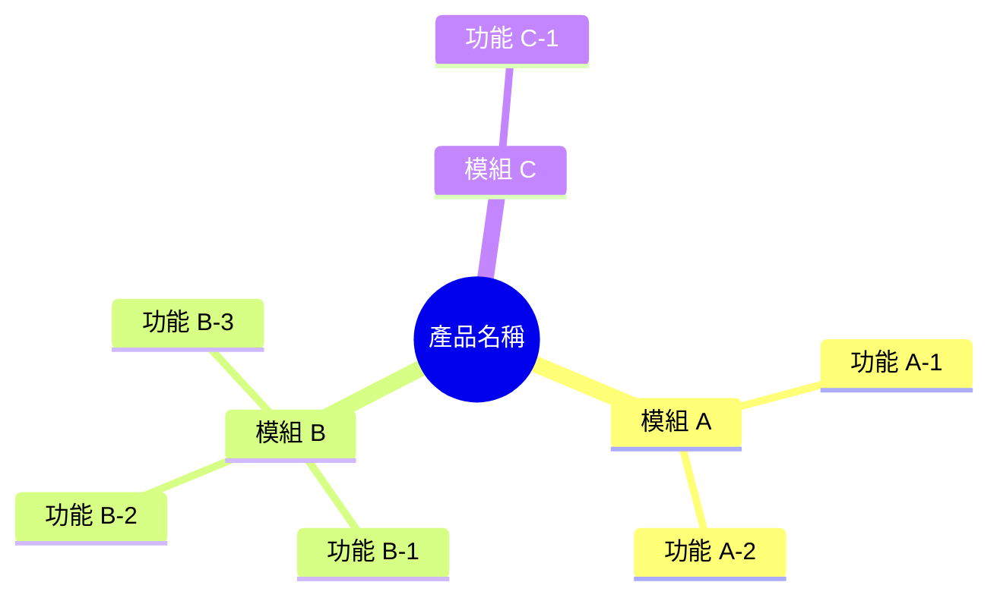
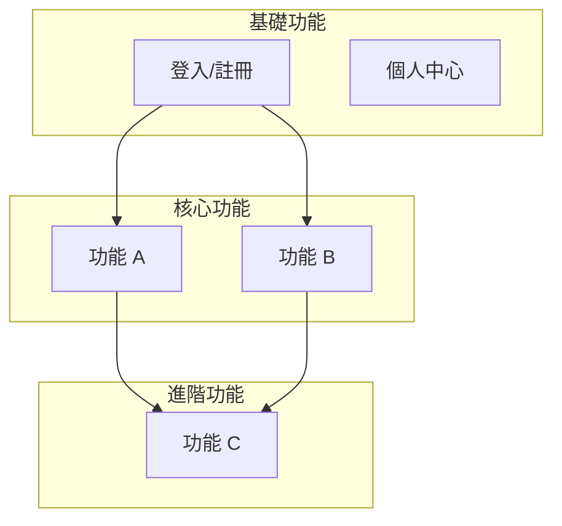

# 功能地圖

> 產品功能總覽，快速了解產品全貌

---

## 產品資訊

| 項目 | 內容 |
|-----|------|
| 產品名稱 | {產品名稱} |
| 版本 | {版本號} |
| 最後更新 | {YYYY-MM-DD} |

---

## 功能架構



---

## 功能清單

### 模組 A：{模組名稱}

| 功能 | 說明 | 狀態 | 規格 |
|-----|------|:----:|------|
| {功能 A-1} | {一句話說明} | ✅ | [spec](./feature-a1/spec.md) |
| {功能 A-2} | {一句話說明} | 🚧 | [spec](./feature-a2/spec.md) |
| {功能 A-3} | {一句話說明} | 📋 | [prd](./feature-a3/prd.md) |

### 模組 B：{模組名稱}

| 功能 | 說明 | 狀態 | 規格 |
|-----|------|:----:|------|
| {功能 B-1} | {一句話說明} | ✅ | [spec](./feature-b1/spec.md) |
| {功能 B-2} | {一句話說明} | ✅ | [spec](./feature-b2/spec.md) |

### 模組 C：{模組名稱}

| 功能 | 說明 | 狀態 | 規格 |
|-----|------|:----:|------|
| {功能 C-1} | {一句話說明} | 💡 | - |

**狀態說明**：
- ✅ 已上線
- 🚧 開發中
- 📋 規格中
- 💡 規劃中
- ❌ 已下線

---

## 頁面地圖

### 主要頁面

```
App
├── 首頁 (/)
│   ├── 功能入口 A
│   └── 功能入口 B
├── 模組 A (/module-a)
│   ├── 列表頁 (/module-a/list)
│   └── 詳情頁 (/module-a/:id)
├── 模組 B (/module-b)
│   ├── 頁面 B-1 (/module-b/page1)
│   └── 頁面 B-2 (/module-b/page2)
├── 個人中心 (/profile)
│   ├── 設定 (/profile/settings)
│   └── 關於 (/profile/about)
└── 登入/註冊 (/auth)
    ├── 登入 (/auth/login)
    └── 註冊 (/auth/register)
```

### 頁面與功能對應

| 頁面 | 路徑 | 包含功能 |
|-----|------|---------|
| 首頁 | `/` | 功能 A-1, 功能 B-1 |
| 列表頁 | `/module-a/list` | 功能 A-2 |
| 詳情頁 | `/module-a/:id` | 功能 A-3 |

---

## 用戶旅程

### 核心旅程 1：{旅程名稱}


**涉及功能**：功能 A-1 → 功能 A-2 → 功能 A-3

### 核心旅程 2：{旅程名稱}


**涉及功能**：登入 → 功能 B-1 → 功能 B-2

---

## 功能依賴



---

## 版本規劃

### 已發布版本

| 版本 | 發布日期 | 主要功能 |
|-----|---------|---------|
| v1.0 | 2024-01-01 | 功能 A-1, A-2, B-1 |
| v1.1 | 2024-02-01 | 功能 A-3, B-2 |

### 規劃中版本

| 版本 | 預計日期 | 主要功能 |
|-----|---------|---------|
| v1.2 | 2024-03-01 | 功能 C-1 |
| v2.0 | 2024-Q2 | 全新模組 D |

---

## 快速連結

### 按模組

| 模組 | 規格目錄 |
|-----|---------|
| 模組 A | [specs/module-a/](./module-a/) |
| 模組 B | [specs/module-b/](./module-b/) |

### 按狀態

| 狀態 | 功能 |
|-----|------|
| 開發中 | 功能 A-2 |
| 規格中 | 功能 A-3 |
| 規劃中 | 功能 C-1 |

---

## 變更紀錄

| 日期 | 變更內容 | 作者 |
|-----|---------|------|
| {日期} | 初版 | @{username} |
| {日期} | 新增功能 A-3 | @{username} |
