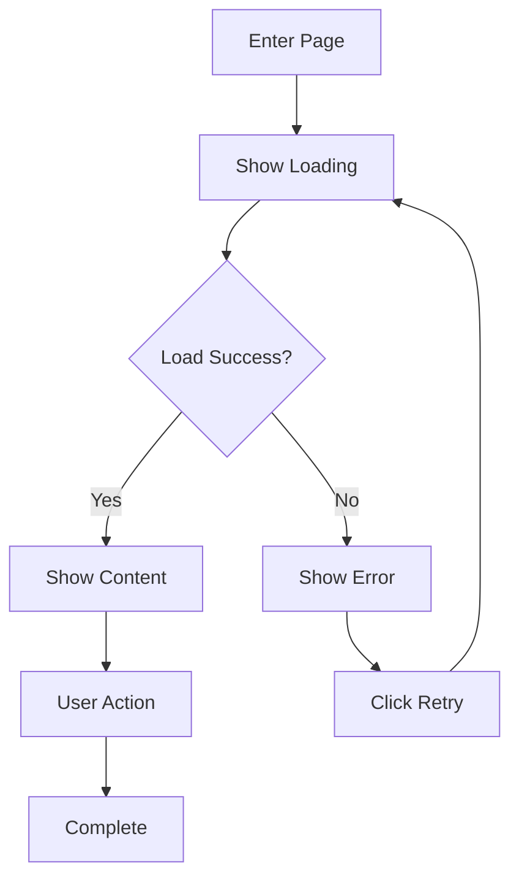

# Spec: {Feature Name}

> Feature Specification Document

---

## Metadata

| Item | Content |
|-----|------|
| Feature ID | {feature-id} |
| Feature Name | {Feature Name} |
| Phase | PH{X} |
| PD Owner | @{username} |
| Created Date | {YYYY-MM-DD} |
| Status | ⚪ Draft / 🔵 Review / ✅ Approved |
| Version | 1.0.0 |

---

## Related Documents

| Type | Document | Owner | Status |
|------|----------|-------|:------:|
| PRD | [{Feature Name}.md](../../prd/ph{X}/{feature-name}.md) | PM | ✅ |
| Contract | [contract.md](./contract.md) | Backend | 🔵 |
| Acceptance | [acceptance.md](./acceptance.md) | QA | 🔵 |

---

## Open Items

| # | Type | Item | Owner | Status | Note |
|:-:|:---:|------|-------|:----:|------|
| 1 | Pending | Mockup design | @PD | 🔵 | - |
| 2 | Dependency | Design System | @PD | 🔵 | Delay impact: Cannot start development |

---

## 1. Overview

### 1.1 Feature Description

{Describe what this feature does in one paragraph}

### 1.2 Related Business Rules

Reference related rules from `knowledge-base/business-logic/`:

- [{Rule Name}](../../knowledge-base/business-logic/{rule}.md)

---

## 2. User Flow

### 2.1 Main Flow



### 2.2 Flow Description

| Step | Description | Trigger |
|:---:|------|---------|
| 1 | {Step description} | {Condition} |
| 2 | {Step description} | {Condition} |

---

## 3. Page Specifications

### 3.1 {Page Name}

#### Mockup

| State | Image | Description |
|-----|------|------|
| Default | [Default.png](./mockup/{page-name}/Default.png) | Default state |
| Loading | [Loading.png](./mockup/{page-name}/Loading.png) | Loading |
| Empty | [Empty.png](./mockup/{page-name}/Empty.png) | No data |
| Error | [Error.png](./mockup/{page-name}/Error.png) | Error state |

#### Page Structure

```
┌─────────────────────────────────────┐
│ Header                              │
│  ← Back          {Page Title}       │
├─────────────────────────────────────┤
│                                     │
│           Main Content              │
│                                     │
├─────────────────────────────────────┤
│ Footer / Actions                    │
└─────────────────────────────────────┘
```

#### Component Specifications

| Component | Component Name | Description | Interaction |
|-----|---------------|------|------|
| Back Button | `BackButton` | ← icon at top left | Click to go back |
| {Component} | `{ComponentName}` | {Description} | {Interaction} |

#### State Design

| State | Trigger | Display |
|-----|---------|---------|
| Default | Normal load complete | Show main content |
| Loading | Data loading | Show loading animation |
| Empty | No data | Show empty state illustration and text |
| Error | Request failed | Show error message + retry button |

---

## 4. Feature Specifications

### 4.1 Feature List

| # | Feature | Description | Priority |
|:-:|-----|------|:------:|
| 1 | {Feature 1} | {Description} | P0 |
| 2 | {Feature 2} | {Description} | P1 |

### 4.2 Feature Details

#### Feature 1: {Feature Name}

**Trigger**:
- {Condition}

**Processing Logic**:
1. {Step 1}
2. {Step 2}
3. {Step 3}

**Output**:
- Success: {Result}
- Failure: {Result}

**Business Rules**:
- {Rule 1}
- {Rule 2}

---

## 5. Interaction Specifications

| Interaction | Trigger | Behavior | Animation |
|-----|------|------|------|
| Pull to refresh | Pull down list | Reload data | 300ms ease-out |
| Tap item | Tap list item | Navigate to detail | Slide from right |
| Long press | Long press 500ms | Show action menu | Pop-up animation |

---

## 6. Data Mapping

### 6.1 Screen to API Mapping

| Screen Field | API Field | Note |
|---------|---------|------|
| {Field name} | `data.{field}` | {Processing note} |

---

## 7. Boundary Conditions

| Scenario | Handling |
|-----|---------|
| Input exceeds limit | {Handling} |
| Network offline | Show error, provide retry |
| {Scenario} | {Handling} |

---

## 8. Non-functional Requirements

### 8.1 Performance

| Item | Requirement |
|-----|------|
| Initial load | < 2 seconds |
| API response | < 500ms |
| Animation | 60fps |

### 8.2 Compatibility

| Platform | Version |
|-----|------|
| iOS | 15.0+ |
| Android | API 26+ |
| Web | Chrome/Safari/Firefox latest 2 versions |

---

## 9. Out of Scope

| Item | Reason | Future Plan |
|-----|------|---------|
| {Item 1} | {Reason} | Phase X |
| {Item 2} | {Reason} | TBD |

---

## Changelog

| Version | Date | Changes | Author |
|-----|------|---------|------|
| 1.0.0 | {date} | Initial version | @{pd} |
