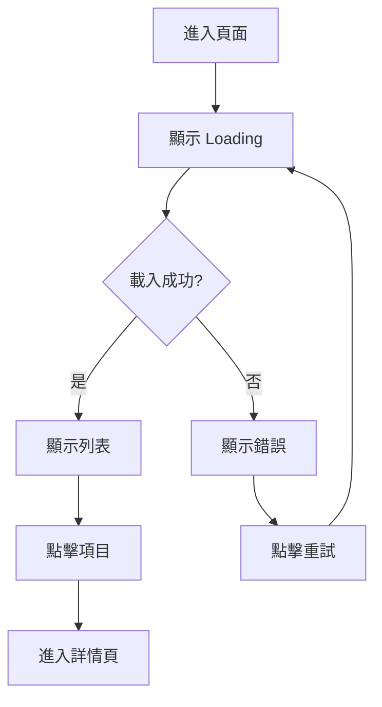

# Spec: {功能名稱}

> 功能規格文件（含設計規格）

---

## Metadata

| 項目 | 內容 |
|-----|------|
| 功能 ID | {FE-XXX} |
| 功能名稱 | {名稱} |
| PRD | [prd.md](./prd.md) |
| 負責 PD | @{username} |
| 建立日期 | {YYYY-MM-DD} |
| 狀態 | Draft / Review / Approved |

---

## 1. 功能概述

### 1.1 功能說明

{用一段話描述這個功能做什麼}

### 1.2 相關業務規則

引用 `knowledge/business/` 中的相關規則：

- [{規則名稱}](../../knowledge/business/rules/xxx.md)
- [{流程名稱}](../../knowledge/business/workflows/xxx.md)

---

## 2. 功能規格

### 2.1 功能清單

| # | 功能 | 描述 | 優先級 |
|:-:|-----|------|:------:|
| 1 | {功能 1} | {描述} | P0 |
| 2 | {功能 2} | {描述} | P0 |
| 3 | {功能 3} | {描述} | P1 |

### 2.2 功能詳細規格

#### 功能 1: {功能名稱}

**觸發條件**：
- {條件}

**處理邏輯**：
```
1. {步驟 1}
2. {步驟 2}
3. {步驟 3}
```

**輸出結果**：
- 成功：{結果}
- 失敗：{結果}

**業務規則**：
- {規則 1}
- {規則 2}

#### 功能 2: {功能名稱}

...

---

## 3. 設計規格

### 3.1 頁面結構

```
┌─────────────────────────────────────┐
│ Header                              │
├─────────────────────────────────────┤
│                                     │
│           Main Content              │
│                                     │
├─────────────────────────────────────┤
│ Footer / Tab Bar                    │
└─────────────────────────────────────┘
```

### 3.2 頁面清單

| 頁面 | 路徑 | 說明 |
|-----|------|------|
| {頁面 1} | `/path` | {說明} |
| {頁面 2} | `/path` | {說明} |

---

## 4. 介面描述

> 💡 使用文字描述介面，待確認後可由設計師產出視覺稿

### 4.1 {頁面名稱}

#### 畫面結構

```
┌─────────────────────────────────────┐
│ ← 返回          頁面標題            │
├─────────────────────────────────────┤
│ ┌─────────────────────────────────┐ │
│ │ 🔍 搜尋框                       │ │
│ └─────────────────────────────────┘ │
├─────────────────────────────────────┤
│ ┌─────────────────────────────────┐ │
│ │ 項目 1                      [>] │ │
│ ├─────────────────────────────────┤ │
│ │ 項目 2                      [>] │ │
│ ├─────────────────────────────────┤ │
│ │ 項目 3                      [>] │ │
│ └─────────────────────────────────┘ │
├─────────────────────────────────────┤
│    [Tab1]    [Tab2]    [Tab3]       │
└─────────────────────────────────────┘
```

#### 元件說明

| 元件 | 說明 | 互動 |
|-----|------|------|
| 返回按鈕 | 左上角 ← 圖示 | 點擊返回上一頁 |
| 搜尋框 | 置頂搜尋輸入框 | 輸入關鍵字即時搜尋 |
| 列表項目 | 顯示項目名稱 | 點擊進入詳情 |

#### 狀態設計

**Loading 狀態**：
```
┌─────────────────────────────────────┐
│ ← 返回          頁面標題            │
├─────────────────────────────────────┤
│                                     │
│         ◌ 載入中...                 │
│                                     │
└─────────────────────────────────────┘
```

**Empty 狀態**：
```
┌─────────────────────────────────────┐
│ ← 返回          頁面標題            │
├─────────────────────────────────────┤
│                                     │
│         📭 目前沒有資料             │
│                                     │
└─────────────────────────────────────┘
```

**Error 狀態**：
```
┌─────────────────────────────────────┐
│ ← 返回          頁面標題            │
├─────────────────────────────────────┤
│                                     │
│         ⚠️ 載入失敗                 │
│         [重試]                      │
│                                     │
└─────────────────────────────────────┘
```

### 4.2 {頁面名稱}

...

---

## 5. 互動規格

### 5.1 互動流程



### 5.2 互動細節

| 互動 | 觸發 | 行為 | 動畫 |
|-----|------|------|------|
| 下拉更新 | 下拉列表 | 重新載入資料 | 300ms ease-out |
| 點擊項目 | 點擊列表項 | 進入詳情頁 | 右滑轉場 |
| 長按項目 | 長按 500ms | 顯示操作選單 | 彈出動畫 |

---

## 6. 元件規格

### 6.1 元件清單

| 元件 | Component Name | 說明 |
|-----|---------------|------|
| 搜尋框 | `SearchInput` | 搜尋輸入元件 |
| 列表項目 | `ListItem` | 可點擊的列表項目 |
| 載入指示 | `LoadingSpinner` | 載入中動畫 |
| 空狀態 | `EmptyState` | 無資料顯示 |
| 錯誤狀態 | `ErrorState` | 錯誤顯示 + 重試 |

### 6.2 元件詳細規格

#### SearchInput 搜尋框

**屬性**：
| 屬性 | 類型 | 說明 |
|-----|------|------|
| placeholder | string | 提示文字 |
| value | string | 輸入值 |
| onSearch | function | 搜尋回調 |

**狀態**：
- Default：顯示 placeholder
- Focus：顯示游標、鍵盤彈出
- Filled：顯示輸入內容 + 清除按鈕

---

## 7. 資料對應

### 7.1 畫面與 API 對應

| 畫面欄位 | API 欄位 | 說明 |
|---------|---------|------|
| 項目名稱 | `data.name` | |
| 項目描述 | `data.description` | 超過 50 字截斷 |
| 更新時間 | `data.updatedAt` | 格式化為相對時間 |

---

## 8. 非功能需求

### 8.1 效能需求

| 項目 | 需求 |
|-----|------|
| 首次載入 | < 2 秒 |
| 搜尋回應 | < 500ms |
| 動畫流暢 | 60fps |

### 8.2 相容性

| 平台 | 版本 |
|-----|------|
| iOS | 15.0+ |
| Android | API 26+ |
| Web | Chrome/Safari/Firefox 最新 2 版 |

---

## 9. Out of Scope

| 項目 | 原因 | 未來計畫 |
|-----|------|---------|
| {項目 1} | {原因} | Phase 2 |
| {項目 2} | {原因} | 待評估 |

---

## 10. 附件

### 10.1 視覺稿（如有）

- [Figma 連結]({url})
- [設計稿圖片](./mockup/)

### 10.2 相關文件

- [PRD](./prd.md)
- [API 契約](./contract.md)
- [驗收標準](./acceptance.md)

---

## 變更紀錄

| 日期 | 版本 | 變更內容 | 作者 |
|-----|------|---------|------|
| {日期} | 1.0 | 初版 | @{username} |
