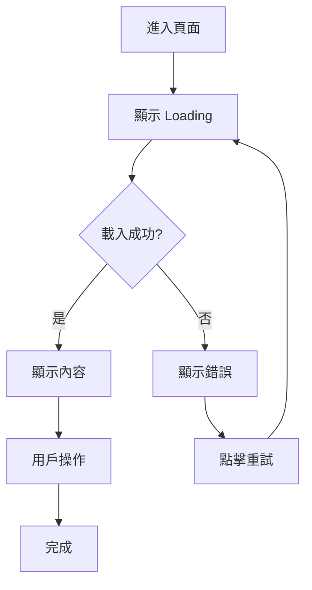

# Spec: {功能名稱}

> 功能規格文件

---

## Metadata

| 項目 | 內容 |
|-----|------|
| Feature ID | {feature-id} |
| Feature Name | {功能名稱} |
| Phase | PH{X} |
| PD Owner | @{username} |
| Created Date | {YYYY-MM-DD} |
| Status | Draft / Review / Approved |
| Version | 1.0.0 |

---

## Related Documents

| Type | Document | Owner | Status |
|------|----------|-------|:------:|
| PRD | [{功能名稱}.md](../../產品需求文件/ph{X}/{功能名稱}.md) | PM | ✅ |
| Contract | [API合約.md](./API合約.md) | Backend | 🔵 |
| Acceptance | [驗收.md](./驗收.md) | QA | 🔵 |

---

## 待確認事項

| # | 類型 | 項目 | 負責人 | 狀態 | 備註 |
|:-:|:---:|------|-------|:----:|------|
| 1 | 待確認 | Mockup 設計稿 | @PD | 🔵 | - |
| 2 | 相依性 | Design System | @PD | 🔵 | 延遲影響：無法開始開發 |

---

## 1. Overview

### 1.1 功能說明

{用一段話描述這個功能做什麼}

### 1.2 相關業務規則

引用 `知識庫/商業邏輯/` 中的相關規則：

- [{規則名稱}](../../知識庫/商業邏輯/{規則}.md)

---

## 2. User Flow

### 2.1 主要流程



### 2.2 流程說明

| 步驟 | 說明 | 觸發條件 |
|:---:|------|---------|
| 1 | {步驟說明} | {條件} |
| 2 | {步驟說明} | {條件} |

---

## 3. 頁面規格

### 3.1 {頁面名稱}

#### Mockup

| 狀態 | 圖片 | 說明 |
|-----|------|------|
| Default | [Default.png](./mockup/{頁面名稱}/Default.png) | 預設狀態 |
| Loading | [Loading.png](./mockup/{頁面名稱}/Loading.png) | 載入中 |
| Empty | [Empty.png](./mockup/{頁面名稱}/Empty.png) | 無資料 |
| Error | [Error.png](./mockup/{頁面名稱}/Error.png) | 錯誤狀態 |

#### 頁面結構

```
┌─────────────────────────────────────┐
│ Header                              │
│  ← 返回          {頁面標題}          │
├─────────────────────────────────────┤
│                                     │
│           Main Content              │
│                                     │
├─────────────────────────────────────┤
│ Footer / Actions                    │
└─────────────────────────────────────┘
```

#### 元件規格

| 元件 | Component Name | 說明 | 互動 |
|-----|---------------|------|------|
| 返回按鈕 | `BackButton` | 左上角 ← 圖示 | 點擊返回上一頁 |
| {元件名稱} | `{ComponentName}` | {說明} | {互動} |

#### 狀態設計

| 狀態 | 觸發條件 | 顯示內容 |
|-----|---------|---------|
| Default | 正常載入完成 | 顯示主要內容 |
| Loading | 資料載入中 | 顯示 Loading 動畫 |
| Empty | 無資料 | 顯示空狀態插圖和文字 |
| Error | 請求失敗 | 顯示錯誤訊息 + 重試按鈕 |

---

## 4. 功能規格

### 4.1 功能清單

| # | 功能 | 描述 | 優先級 |
|:-:|-----|------|:------:|
| 1 | {功能 1} | {描述} | P0 |
| 2 | {功能 2} | {描述} | P1 |

### 4.2 功能詳細規格

#### 功能 1: {功能名稱}

**觸發條件**：
- {條件}

**處理邏輯**：
1. {步驟 1}
2. {步驟 2}
3. {步驟 3}

**輸出結果**：
- 成功：{結果}
- 失敗：{結果}

**業務規則**：
- {規則 1}
- {規則 2}

---

## 5. 互動規格

| 互動 | 觸發 | 行為 | 動畫 |
|-----|------|------|------|
| 下拉更新 | 下拉列表 | 重新載入資料 | 300ms ease-out |
| 點擊項目 | 點擊列表項 | 進入詳情頁 | 右滑轉場 |
| 長按項目 | 長按 500ms | 顯示操作選單 | 彈出動畫 |

---

## 6. 資料對應

### 6.1 畫面與 API 對應

| 畫面欄位 | API 欄位 | 說明 |
|---------|---------|------|
| {欄位名稱} | `data.{field}` | {處理說明} |

---

## 7. 邊界條件

| 情境 | 處理方式 |
|-----|---------|
| 輸入超過上限 | {處理方式} |
| 網路斷線 | 顯示錯誤，提供重試 |
| {情境} | {處理方式} |

---

## 8. 非功能需求

### 8.1 效能需求

| 項目 | 需求 |
|-----|------|
| 首次載入 | < 2 秒 |
| API 回應 | < 500ms |
| 動畫流暢 | 60fps |

### 8.2 相容性

| 平台 | 版本 |
|-----|------|
| iOS | 15.0+ |
| Android | API 26+ |
| Web | Chrome/Safari/Firefox 最新 2 版 |

---

## 9. Out of Scope

| 項目 | 原因 | 未來計畫 |
|-----|------|---------|
| {項目 1} | {原因} | Phase X |
| {項目 2} | {原因} | 待評估 |

---

## Change Log

| 版本 | 日期 | 變更內容 | 作者 |
|-----|------|---------|------|
| 1.0.0 | {date} | 初版 | @{pd} |
